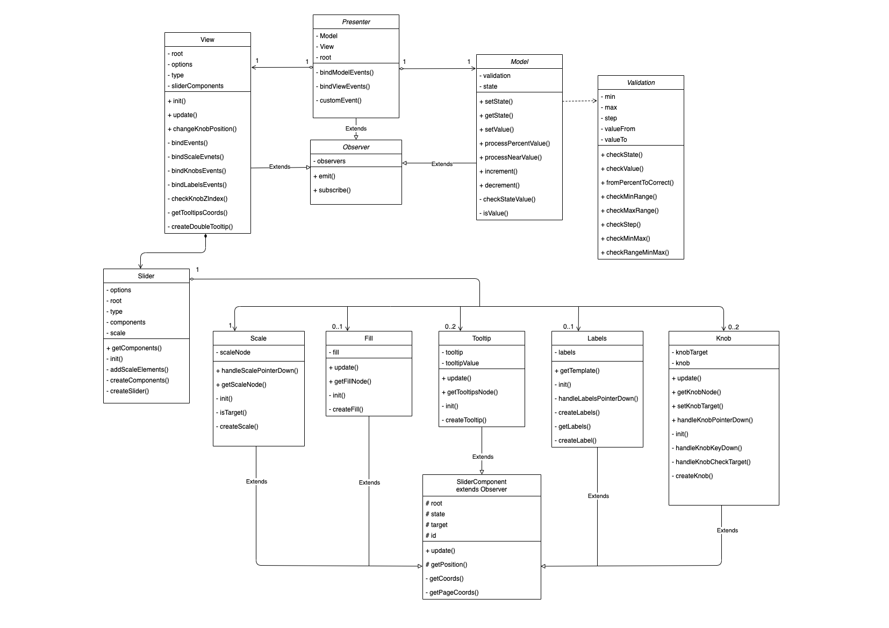

# MetaLamp 4 task - Slider for jQuery

Четвертое задание - плагин для [jQuery](https://jquery.com), в котором выполнен функционал «бегунка» (также называемого слайдером) - специальный контрол, который позволяет перетягиванием задавать какое-то числовое значение. 

[Демо страница](https://yarlykov.github.io/slider-plugin-jquery/)

## Содержание

- [`Возможности`](#возможности)
- [`Развертывание`](#развертывание)
- [`Подключение и использование`](#подключение-и-использование)
- [`API`](#api)
- [`Архитектура`](#архитектура)
- [`UML-диаграмма`](#uml-диаграмма-классов)
- [`Использованные инструменты`](#использованные-инструменты)

## Возможности

  - Любое количество слайдеров на странице без конфликтов
  - Простое и удобное API для взаимодействия со слайдером
  - Два типа слайдера (одиночный и диапазон)
  - Поддержка отрицательных значений
  - Широкие возможности кастомизации
    - задание размера шага
    - выбор вертикального либо горизонтального вида
    - возможность задать диапазон значений
    - возможность вкл/откл прогресс бар
    - возможность вкл/откл подписи шкалы значений
    - возможность вкл/откл подписи над ползунками
  - Поддержка тач устройств
  - Поддержка управления с клавиатуры
  - Подстраивается под изменения ширины/высоты контейнера

## Развертывание


### Клонирование репозитория

```bash
  git clone https://github.com/yarlykov/slider-plugin-jquery.git
```

### Установка зависимостей

`npm install`

| Разработка    | Тестирование |  Покрытие тестами       | Production сборка |
| ------------- | :----------: | :---------------------: | ----------------: |
| `npm run dev` |  `npm test`  | `npm run test:coverage` |   `npm run build` |

## Подключение и использование


1. Для работы плагина необходимо подключить `jQuery-3.x
2. Для подключения плагина на страницу необходимо взять из папки `./dist` файлы: 
    - `plugin.js`
    - `plugin.css`


Пример подключения на страницу:
```html
<html>
  <head>
    ...
    <!--jQuery-->
    <script defer="defer" 
      src="https://code.jquery.com/jquery-3.6.0.min.js">
    </script>
    <!--Plugin JavaScript file-->
    <script defer="defer" src="plugin.js"></script>
    <!--Plugin styles file-->
    <link href="plugin.css" rel="stylesheet" />
  </head>
</html>
```
Инициализация с настройками по умолчанию:
```html
  <!--HTML-->
  <body>
    ...
    <div id="root"></div>
  </body>
```
```js
  // JavaScript
  $('#root').sliderPlugin();
```

С пользовательскими настройками:
```js
  $('#root').sliderPlugin({
    min: 0,
    max: 100,
    step: 25,
    valueFrom: 50,
    valueTo: 75,
    orientation: 'horizontal',
    isRange: false,
    hasFill: true,
    hasLabels: true,
    hasTooltips: true,
    color: 'orange',
  })
```

### Опции

| Опции         | Тип          |  По-умолчанию       | Описание                      |
| ------------- | :----------: | :-----------------: | ---------------------------:  |
| `min`         |  number      |  `0`                |   минимальное значение шкалы  |
| `max`         |  number      |  `100`              |   максимальное значение шкалы |
| `step`        |  number      |  `25`               |   шаг шкалы                   |
| `valueFrom`   |  number      |  `50`               |   значение одиночного ползунка / начальное знач. диапазона | 
| `valueTo`     |  number      |  `75`               |   конечное значение диапазона    |
| -----         |  -----       |  -----              |   -----    |
| `orientation` |  string      |  `'horizontal' `    |   ориентация слайдера (horizontal/vertical) |
| `isRange`     |  boolean     |  `false`            |   тип слайдера (одиночный/диапазон) |
| `hasFill`     |  boolean     |  `true`             |   заливка (от min до valueFrom либо от valueFrom до valueTo) |
| `hasLabels`   |  boolean     |  `true`             |   подписи шкалы значений |
| `hasTooltips` |  boolean     |  `true`             |   отображение текущего значения над ползунком |
| `color`       |  string      |  `'orange'`         |   цвет слайдера (orange/green) |

## API

sliderPlugin( *method*: **'getState'** | **'setValue'** | **'onChange'**, **options**)

Плагин принимает в качестве параметров объект с опциями либо методы для изменения и получения данных.

`getState(): IOptions` - метод, который возвращает текущее состояние слайдера в виде объекта со всеми опциями.

```js
  const state = $('#root').sliderPlugin('getState') 
  console.log(state) // {min: 0, max: 100, step: 25, valueFrom: 50, valueTo: 75, …}
```
---
`setValue( name: string, value: number | string | boolean ): void` - метод для изменения любого значения слайдера. Принимает название параметра (`string`) и значение (`string`, `number`, `boolean`)

```js
  $('#root').sliderPlugin('setValue', 'min', -100) 
  $('#root').sliderPlugin('setValue', 'valueFrom', 20) 
  $('#root').sliderPlugin('setValue', 'orientation', 'vertical') 
  $('#root').sliderPlugin('setValue', 'isRange', true) 
  $('#root').sliderPlugin('setValue', 'hasTooltips', false) 
  $('#root').sliderPlugin('setValue', 'hasLabels', false) 
```
---
### Кастомное событие

`onChange( func: EventCallback ): void` - метод который позволяет передать callback функцию на событие изменения слайдера. 

```js
  $('#root').sliderPlugin('onChange', () => {
    `any code`
  }) 
```

Также позволяет через объект `detail` получить любые значение слайдера.

```js
  $('#root').sliderPlugin('onChange', (evt) => console.log(evt.detail)) 
```

## Архитектура

Плагин построен по MVP-архитектуре с Passive View. Такой подход позволяет отделить бизнес-логику от отображения. Отвязка слоев приложения осуществляется благодаря использованию паттерна `Observer`, который расширяет основные модули и позволяет им взаимодействовать ничего не зная друг о друге. 

### Model

  **Model** является модулем отвечающим за хранение всего состояния приложения и валидацию данных (расчеты, которые относятся к бизнес-логике). Предоставляет методы для чтения и записи (всех параметров либо каждого по отдельности), а также методы для обработки значений слайдера полученных в процентах и методы увеличения/уменьшения значения ползунка на величину шага.


### View
  **View** отвечает за создание отображения, его обновление и взаимодействие с пользователем.
  Отображение декомпозировано на более мелкие элементы ( *subView* ), которые наследуются от общего абстрактного класса `SliderComponent`. Это решение позволило создать единый интерфейс всех графических компонентов и расширить их классом `Observer`, чтобы на их изменения можно было легко подписываться. Также данный подход позволяет `subView` оставаться низкоуровневыми элементами и ничего не знать о модулях высокого уровня, но при этом всегда иметь доступ к актуальному состоянию для внутренних расчетов.
  
  Все `subView` имеют схожий базовый интерфейс, каждый компонент умеет создавать совой элемент, в случае необходимости добавлять слушателей и сообщать о своих изменениях. Также каждый `subView` имеет возможность обновления своих отдельных стилей (без полной перерисовки всего компонента).
  
  Для инициализации либо пересоздания графической части существует `Slider` - это класс-фабрика, который в соответствие с переданными опциями создает все элементы слайдера и формирует объект с созданными компонентами, после чего `View` может легко взаимодействовать с `subView`. Это позволяет локализовать и изолировать в одном месте создание всех графических компонентов.
  
  Связь между `View` и `subView` осуществляется также с помощью паттерна `Observer`, что позволяет уменьшить сложность графической части, обеспечить простое взаимодействие, слабую связность и модульность элементов.

Помимо прослушивания событий `subView` в классе `View` также реализованы некоторые фичи слайдера:

  - метод `checkKnobZIndex()` меняет свойство `z-index` у ползунков в зависимости от того, какой из-них задействован в данный момент;
  - метод `createDoubleTooltip()` отвечает за то, чтобы у двойного слайдера ползунки объединялись в один общий;
  - также во `View` реализована возможность перехвата `target` со шкалы, чтобы после нажатия на любое место шкалы можно было сразу передвигать ползунок. 
  
### Presenter
  **Presenter** - единственный модуль, который имеет зависимости от других слоев приложения.
  + Presenter создает модель и отображение
  + Подписывается на изменения модели и отображения
  + Реагирует на сообщения об обновлении модели и обновляет отображение
  + Реагирует на сообщения от отображения о действиях пользователей и обновляет модель
  + Формирует кастомное событие, для того, чтобы была возможность получать актуальные данные либо осуществлять стороннюю логику при перемещении слайдера.

  Таким образом передача данных снизу вверх осуществляется следующим образом `subVeiw` ->`View` -> `Presenter` -> `Model`

## UML диаграмма классов


[открыть превью диаграммы в draw.io для удобного просмотра](https://viewer.diagrams.net/?tags=%7B%7D&highlight=0000ff&edit=_blank&layers=1&nav=1&title=UML-20.01.22-slider.drawio#R7V1Zc5tK0%2F41rvq%2BC7nYl8vYjpMcJzl24iTOuUlhMZawESgIL8qvf4dlEDCNNCBAxIwrVRGITfN0N91P9%2FQcyaeLl3eBtZx%2F8m3kHkmC%2FXIknx1JkqhIGv4v2rNO9ui6mOyYBY6dHrTZ8dX5g9KdQrr30bHRqnBg6Ptu6CyLO6e%2B56FpWNhnBYH%2FXDzszneLd11aM0Tt%2BDq1XHrvD8cO5%2BleTVU2X7xHzmxObi1qZvLNrTV9mAX%2Bo5fe0PM9lHyzsMh10h%2B5mlu2%2F5zbJb89kk8D3w%2BTT4uXU%2BRG40qG7MeH9Q%2F344P27p%2Br1W%2Fr28nF9efvk%2BRi53VOyX5dgLyw8aX%2FPNydv%2F%2Bu3N8sL8%2BvnoV3b27%2FmaSnCE%2BW%2B5gOZSoc8Q8O12SAV8%2FOwrXw0Mgnd74Xfk2%2FwWNwYrnOzMOfp%2FjhUIB3PKEgdDA2b9IvQn%2BJ907njmt%2FtNb%2BY%2FQTViEed7J1MvcD5w%2B%2BrOXir0S8A38dhKmYYdnMH%2FE1OhPvFvDeAK3wMZdkXMRs10drFabHTH3XtZYr5zZ%2B4OiQhRXMHO%2FED0N%2FQS4UCQCy060M6HgjDPyHTKqi8xnRSFGLRgO95MQ0Recd8hcoDNb4kPRbw0i1cE2UK73Ec16kU8TmOWmWBSNVpVSNZtm1s9t9wWpneTM8CNn98HnF%2BykC2%2F2ItSC3s1wMvGeF6CQaxlVeCvGH3E%2Fd7Ipls4acSpScTpJNx7ZCx%2FcogcVjHuaE00V3YaVorpbW1PFmH%2BNjzpTNni%2Fpb452%2BfjcOzcWi7lj28iLxSa0QiuRrEhWlr7jhfGgqCf4Hx66U%2BFYPVLxA53ibXGzjf9Fhwfhqe9hCbOcWJQQFttnFInuNomchws3%2FUiL4lYt3y2K6yLCOyVBqBa8ggjUxVsE8cZmIUSvDuquQFQODaJCgUhh5zrxOyUVaRG0tzuAXWCIossRJK8joM8mIoW2TKMtA8i61i1yL%2F2VE9sV%2BSxIji0hfihQNUZQt7wR9sJUBTA9iTBF2CnA2vl%2F%2F38UGQ9Z3Jgnrqo7UdWVZm%2FeJrB%2BMCbWHX5pqurH9YXz9dvNs%2F1rIgpyBbAzDuwewIpCQ5%2BqRWQhM5yq7PdoH0e2EbLMPlJ3yFYZ42XgT9FqdYmCKCjjIDcHWZX6A3n541R7O53Yk6vZv7eq8PvEPbcm2naIPyMr4Pg2x1c3DoxvlQo73jRAC%2FxzObCNAlihR48KBNaoANZGHNh9gJUP71DRNjkiJ6ZzNH2IXWVukJvDq%2FboVQn208%2FnX1fXP63z4Id84bq%2Frr9MJB1E11lxVJujavToRoGPTKvsdwc9UwBWpDmEI57mOGorzSELxTSHxmjQZUKS1MtyiKUsh2wMN8sBm544wzhSU6MxS9dQMhe03xdh6C8jNnn1ml8erWasauPeZ7Lj4tE6%2B%2FPn6sPD6bl76b05C3%2F%2F%2FFGRoQzXy9eXsDos0qwZkDaQhgMACQ4AVq5jo%2BDUXyx9D0VjzXFvE3fj0JbdpFCnEB57OrM2qFkwfah8pkhXGhACzokpmlemw50BKR48hSlVUW6PSztNYHIw2cBsWgnWGntKCkspLKdzHN%2BhC8%2B%2FJTaN48qOK7Pv1JmSyjSwke9063j226fIa%2BJwssNp9kirVcAJhz0RnHF59tsnD3FM6%2FAXYo8ZyQpM6VIggmlkd1dcT%2BtiqhzcN5LpIiCC6ccoQOCg1gZV79FHAhknWE3jNGSkp%2F99wMH6C0eUHVGzR%2B8IRBRW0hkKr9PJVKe%2BH9hcS9kxlQlJczBM6QKfWEsDhEPSM%2F8Rj2YKLkeVHVXl0E4SHcX8e7tCAf4JFIh86lz3OWVVT1OnWRYQeDnrgICI29ji6qSyJqrF%2BzV1BtpNKsO%2BH2iA%2FFRcX1%2BWgpaxrRq8V2YZEqnO8k58OlX7oEJpYwjUFtIP4ANXlf%2BixUiyD%2B3AqAIBNqibXfkDZlUaafV4u5oGzu040g%2FtoAlVaPWLpklhhewZIq5b3COi7PngcZr7M9%2Bz3I9%2BbDIji3mPwnCdOmPWY%2BgXbTN6ccKb3Oef0aXw2CdbZy%2FpleON9VFVdn3bmK%2F8x2CKdtsf7DPiKHP3cdEobEUwQC4%2B9Sl%2FUCcl2CIHaNAA6XQpI4VYA0A2iMb%2BSDx4lyhw8FOj4GtiEFMc7h8XSyIPVjAlkdGbqNsM3mU71sL37Ou545Gvzh03A96zyYH%2BMjajeE%2F6fXTxBI6KOxOpEY4VXc1JjngsiNJW2cEiE6zTU2WR7PiZ%2F3ZzYrxVODN7nty1y%2Fto8dwWgeXFcxu7sVs8WeUzfUFMhGNDEaRCkDUhQRezDKeXv4xeeZtr4%2BitcF1F0o%2FN%2FF%2FxgqmUJdfY6MXuy6qleuVUaKovRA707%2B5WqHAMFkZrnTsifYlX%2FkTZKA6dogv1nr14PP6QPEGrgSltIr4WK%2Bhy1bLYU0JxfCxseJbqUtoDlvErwkgoF73UrcgwZMpry2LhgtdGcsb1KBdZLdbxG01n1vdAuUCFSPLRaCr5t2o7e2hO4wvLU2d1vjJU8SkfjacPUTtAAlxsZ0CuzXf6hfXh6Zt4s9L%2FnfqfVhfzzG%2BgcEzdFg5k47i8MyDhORYQBSonZ3EQm3ek6dmuQrWdnMjeE1aJEdaumGxRAlAdWfV1W1DS2W1YQ9vgP53L%2B8%2BX3vtvFzeWPfmkP75zv4AzXSIzG4evI6q6bglPIDvRL55wzTVGc0T1RC1hyewDdYUlnM6PNNOaIY5nTTwlYP5Zd3jCUSYFaNLYfECk1mjqiGSzSGppImvRh9isOUWR09KH0ZsCllO4kHEVyepn3359dEjT2c7btbz9cqPODBPUepCHaXvCCjWU7LPgSFSqSo7mloeBiN89cXYIBWf%2B84j9%2FPrYshadtqGyINEpbWviTAw1R3S%2FnhP9GmEFnhMymu4ELQEpiox2t0MkqxoLXsdZCI5mDTRlYP5Hz2hWNAGN5%2FXEtpYDWqcxwaELeEWa84zrvXgU3n8UrpU7REJROBQWi2qjhbAySUvvZzbtZdNuGA67eLA%2FcAfJ6ljMjcksYAdoEgk%2BMgmleWzdJqysPSBbiK3BpkVV0dfYM6D1kYTm8%2FTbMEOBNDQNpSPHYOSRdG1EmzLb7ZlcHki3gSNzw8YOVbOi8UkcekW6yfGsE0oDxEi%2FikkT0lH7GgpCHnl1H3mJWauqLaGXRNYdK3TnlxolQKVS6GUMuJFCRdvnByys16MuJM40eJ8ADJSqNgKwpXYv%2FneP7NPfvx9ezq%2Bmn74FLxVdeR4gu%2FO3g9hqHrs%2B1EBQ1hnU8CNDs3F4rL0nrEAnWRDWzvLYJJHOo%2B29sQRWH4ZVtKseaSAdlgbbkS847mC7PqDgHI9%2BEa3iwlYJomPPeTbAlNln6izwVqtATUqHkqbsvHKoCbhAWVjP4CrwwlXj5scaIAmsKNwZkvBsVxjIjY5eoDXXz5rxKrCccL%2BokvCoEtXTqO8zf63WRhZYT7gzZEEqAi4LS9jsCFiOZg00geWD%2B32PyjScaX9nCkVOaHdPaBti01IivVEpkTJMPht2FOA8WlghriMxOnL9OYQ9VhPBQMKp7RTIeN1yjuYQF5KF2zzz9hgdwMq68llnfLXGq8PawhLgqzsrWQANLrDqWcZXk6Vaxs1Z1wcV4qx7LizSaFg5BdYASWaHqDskYY8oCarHtN5OW5BC05Z7hVSh5%2BckC9dRIPKwuoc6MUFiiKvhRhlbJKQ6rtZK3V8H0ikDzn3CVK0Li%2BtIbE6mv39PAwywwoQHYnvCevAGGDoUXxPnHS2W7qijsfqA9tn1osLbo30D7rfXB%2FLwzS50mJFOkpyJu8cLTBph22v%2FC9grghsXJiFZgi0H9K9qgaFXtqLkcNaG8%2FANMHSY%2FcopKAe0BqDmod0ilZ7jkqyvQ4HIGZMeGBMzVS8SBjHT3YT5qLlcTqkQQYHkcSiFCKDh8ZdRADtawkRtY1JdZ5lr0MUDFnaIgBzzqkf1Ueyz%2FgBGEVbHcL0cbRVJfRRZyw26Q7HCmyNr63G7uhcv0i%2BWMC2yAtvEcxj37lzSVWWXymcid4Erq9%2FTQkYBVE9otZw0n5AtZTpiMqQBojJrgVdnFpc3i2oFSOY%2Bbp0BCTf6sGw77tH71kULrp01QWUuv%2BwM1G29l7nJbQSqeXBQt82DS4hLDmgNMoi5h3FX3i6QzP2OcbKt2I1k5KAlzkG3yEFnWWCi9cAa26CQyKQdas3ubmRybd37HaC7mw67fAuHltWRGB29lTWr%2BrU5sLu3sF5eHYittnWrD%2FXBp8npsBO4CtHrm7p6YKz7JLMrVgyHncN48zzAb1mOeKuI90l5VyAOd7GJN699jne7eB%2BeG9dpDadAHjs33gDXHrlx%2BJGhlEdEjk%2BjdkU41BpzrX0DPJmZ8c7KBIEijxyicbMJjmidws8epz2Dq9ZUpa%2FusF91iYKIdbn2T%2F0gwPE9R7YGssxOVHe6Spfy5HT1k%2BN9sbwZV9datKp0cFClraBaLxzUuqBCcyl6BrWqO0zqJ6ERtytowkMe3k2i6eSi6cWKyiGtAWnT%2BvUWIaXJ5RyksdXluNbFVWZtyNgZroZBoYXsGSIZSM%2BPSYciQYNHau7PfM9yP%2FoxgxARCPcoDNdpTtF6DP0iVYFenPAmOv1YV9PNn%2BnVos9nL%2FmN9VEV4bMtE7jyH7G7vk2EU18%2FTJYr2n1gNBBbUQyQi899yh%2FUierR7NBlgFZJQriMHk8ld59KVo3UCyXmWWfT4mwaVM32L4R3JNmn4eaRxYr%2B6598G413iWZx0F1VK54Zbivx3UHPrw7HVvMPDdDuM50MzkEc0dS1Q2N9%2BHQy0KGLQnnsyaYGwLISnp21diIwlrT41vHs%2BPX79onUBeMnlcWNmL8i7e4OXuYS4c4icGBVMYJv9Fbm8O4Db2YVD4hvRdvWxxUOf2J0ObgNwWV2sFoAV7Cffj7%2Furr%2BaZ0HP%2BQL1%2F11%2FWUCYEvhhzz7TRDEw%2B0v48G2rdU8dlVEmE0hn2Mq5ZgQKzCZggc1WEcnTYRjQTDInuRUQSXbm5Pjrc3ZdrS2fP67SxQ4eHAiImFPtubPw935%2B%2B%2FK%2Fc3y8vzqWXj35vafCVmjeCdZQ4ped5I1OexVAHqyj5nTSe8Qt2TLxeqkkRDpdKKU%2FLjkh6dnbaSKupAuFS%2BUtTAhF0pGhrpQg0gelliI762WWNuxFr5nX88dr0JWsdRpBXk1dwlsXuRinqmkHvG%2BslgmLKOwkejkZqKyU8Txzcsy3YegG4yCnvl3A5V0uamkK6XmQKKs9ivpdC01g23eaY6jqL6hfBeVqVLMY0uuFeR8pxkH5BkS%2FOYyvl1281IOasOwZNyUpGOyNOimCO3YJAsi1hV1wygyubJQcjg6FnWlnqhXG3XaHcgUIOdV6FoTeawnezvtpjosB8Eot0LTG5pNUZSLXehV2WQSJoyutc4dlrrw7E%2Bccvwb2Uyu2K6kMlRE5yQ1zVMW%2BCoGhyHLSkqynjfe2w13D%2FZSHpTMKiVJ08pd%2Bdid2pLIloW%2FJZEtPzC5T7ciC9WS1hHZnDiaErM4sgp6WWSLRHjLAkzGYiACLApaUSD0pla3LwkWBf0AIqzSqQGC%2BEaG48R9jgIihBMh5MuM022av08Y%2FBNr%2BjCLZe%2FUd%2F1gowhxtUJSSCBG0m87Uc11wvVjdCIpqSmlU9%2Fzomz6LXly8uuYE%2F1yOZoXS2i3RhABy20Ix8e0Aaka%2FAq2r%2BHY9z3ORtWCOu2PM02iH0zC%2Bx5lpWQEtXL0sduQTmS5cIlSMsu%2Fu1uhTiIXlSZQsX6wQ%2Fd364dWtZBz%2B%2FrBQPu9UvUwyzxUmXFl8DOImJL3hdafgtQL7bd6n%2BwlmizOZz0cmcs4B%2BJaltdYb0z4a0ozz7I1AaIr90ZkYUVB6c3E1osTAb55k%2BeQimmOHXRbQVvTgafZZbux7u7k4sjam0PRXXWHyjHzuiXPSi5Xb3Wsu%2BDy2uN4a1OukVH7rX0wpxbo4rPNEty6flRQX03Es%2Bl3PnskFRl7TZZ7Zuydy%2FvPl977bxc3lj35pD%2B%2Bc79MhvWCV0pEjCE3pY4MvXAh%2FMphS3TWZj9LTywKKbvQKXcE9DB5%2BxIiMtGgPMMoXlOpKMw756dkJaVlW0bXgNIiuV0Dy%2FamyjRV2qFJNLVJUfYTue5NjkEzfNtMDhAmbJyPgu8h7jQcdS1Vy77HwOIGzaCUVG5oV0rJDoMUm%2FXkfBh0n4XhK75R5WjUVnzhWJQEefB6Lw1P74k%2FU52WPdhcUZ3RqAwtoDHLvkrDQhVRLF%2Bpb6NCRzR%2FgVEhStaGNyHJpbCECO%2BAjczeHGQrRqZlx2FoueyssdHenoMol4JnU%2BlZy7fEDJobsRK3Af4020wPGKbetxZFYGfCIJ02%2Fhq1N%2BmYYjQ5VbUca0tyNTJ70cYm7WaPZpR1qVSEu42cryD5JKWoVyXupUP1oF3v0QBnkqUTsurp%2BsCJRtkgyr1BRzs0lV5oJ35Ng0ioQcBVTyp2Bk8Co2OVzeQbiGely0VhlRsXCZb6w%2FSdDjLrFU%2FvzCsUJlYVJ5wcaxLLxCp6eows6tvFuPvpWBWl1zKj%2BCqDEl5ZLcqcZDalE9XiuzZrbNCX8NJ1CMOP%2FM2qOclNIn9BJvOLCAT7SUgP78m2St%2BjWaJFO2Go0lY7wcYoZgYsb7yiodb1JgnPPqaA0FYIbGA9rNlNuqIdK6aQ%2FZVskmEe62bur%2BSDs5ook7J1pQft2ESJAh3x%2FgU2iihpCyyFoJF02hBZiqV2L%2F53j%2BzT378fXs6vpp%2B%2BBS8TlrZHO5z4PTIZplmYYHasyfXdnz0szPDLLESpRGuaRtPchVwKOs1ySWZbc3TKN2q90AIW5IHnW7drXwvGR1eEYiXNnv5RJoEliyYVr9CdaSJxZ6eTXTfz%2Feq3Rh2KjZB3Feky24iq6XUd2Ihu5%2FGB%2FRxp2mpMk8nk4otEk2sLmiqVbUHpXdSKLQChk0c8QU0UtNILdSh0Md6Mu6HmDg%2Bs5Txpayy%2F%2FR8%3D)

## Использованные инструменты

- [Typescript 4](https://github.com/microsoft/TypeScript/#readme) 
- [Webpack 5](https://github.com/webpack/webpack)
- [Babel 7](https://github.com/babel/babel)
- [Jest 27](https://github.com/facebook/jest)
- [jQuery 3.6](https://github.com/jquery)
- [ESLint 7](https://github.com/eslint/eslint)
- [Stylelint 13](https://github.com/stylelint/stylelint)
- [cross-env 7](https://github.com/kentcdodds/cross-env)
