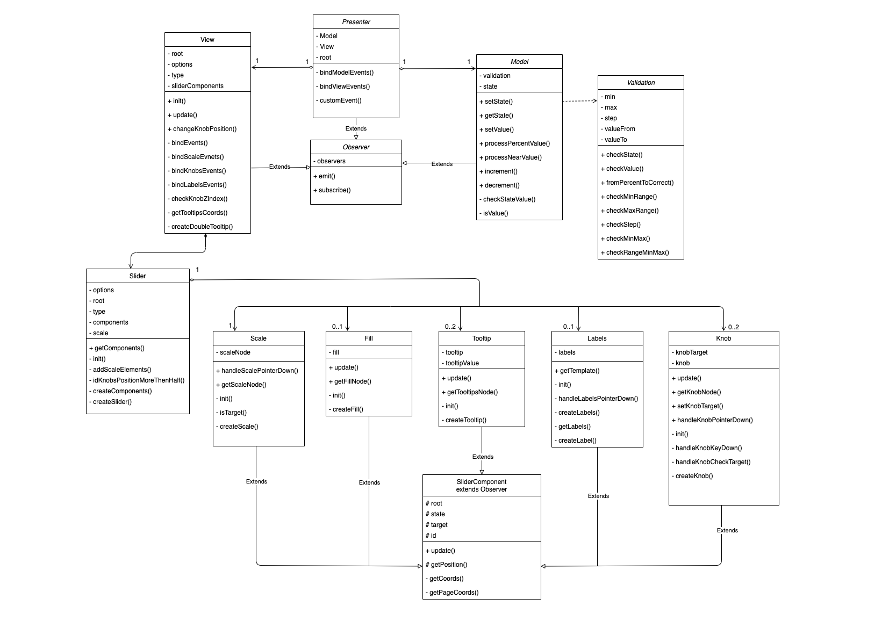

# MetaLamp 4 task - Slider for jQuery

Четвертое задание - плагин для [jQuery](https://jquery.com), в котором выполнен функционал «бегунка» (также называемого слайдером) - специальный контрол, который позволяет перетягиванием задавать какое-то числовое значение. 

[Демо страница](https://yarlykov.github.io/slider-plugin-jquery/)

## Содержание

- [`Возможности`](#возможности)
- [`Развертывание`](#развертывание)
- [`Подключение и использование`](#подключение-и-использование)
- [`API`](#api)
- [`Архитектура`](#архитектура)
- [`UML-диаграмма`](#uml-диаграмма-классов)
- [`Использованные инструменты`](#использованные-инструменты)

## Возможности

  - Любое количество слайдеров на странице без конфликтов
  - Простое и удобное API для взаимодействия со слайдером
  - Два типа слайдера (одиночный и диапазон)
  - Поддержка отрицательных значений
  - Широкие возможности кастомизации
    - задание размера шага
    - выбор вертикального либо горизонтального вида
    - возможность задать диапазон значений
    - возможность вкл/откл прогресс бар
    - возможность вкл/откл подписи шкалы значений
    - возможность вкл/откл подписи над ползунками
  - Поддержка тач устройств
  - Поддержка управления с клавиатуры
  - Подстраивается под изменения ширины/высоты контейнера

## Развертывание


### Клонирование репозитория

```bash
  git clone https://github.com/yarlykov/slider-plugin-jquery.git
```

### Установка зависимостей

`npm install`

| Разработка    | Тестирование |  Покрытие тестами       | Production сборка |
| ------------- | :----------: | :---------------------: | ----------------: |
| `npm run dev` |  `npm test`  | `npm run test:coverage` |   `npm run build` |

## Подключение и использование


1. Для работы плагина необходимо подключить `jQuery-3.x
2. Для подключения плагина на страницу необходимо взять из папки `./dist` файлы: 
    - `plugin.js`
    - `plugin.css`


Пример подключения на страницу:
```html
<html>
  <head>
    ...
    <!--jQuery-->
    <script defer="defer" 
      src="https://code.jquery.com/jquery-3.6.0.min.js">
    </script>
    <!--Plugin JavaScript file-->
    <script defer="defer" src="plugin.js"></script>
    <!--Plugin styles file-->
    <link href="plugin.css" rel="stylesheet" />
  </head>
</html>
```
Инициализация с настройками по умолчанию:
```html
  <!--HTML-->
  <body>
    ...
    <div id="root"></div>
  </body>
```
```js
  // JavaScript
  $('#root').sliderPlugin();
```

С пользовательскими настройками:
```js
  $('#root').sliderPlugin({
    min: 0,
    max: 100,
    step: 25,
    valueFrom: 50,
    valueTo: 75,
    orientation: 'horizontal',
    isRange: false,
    hasFill: true,
    hasLabels: true,
    hasTooltips: true,
    color: 'orange',
  })
```

### Опции

| Опции         | Тип          |  По-умолчанию       | Описание                      |
| ------------- | :----------: | :-----------------: | ---------------------------:  |
| `min`         |  number      |  `0`                |   минимальное значение шкалы  |
| `max`         |  number      |  `100`              |   максимальное значение шкалы |
| `step`        |  number      |  `25`               |   шаг шкалы                   |
| `valueFrom`   |  number      |  `50`               |   значение одиночного ползунка / начальное знач. диапазона | 
| `valueTo`     |  number      |  `75`               |   конечное значение диапазона    |
| -----         |  -----       |  -----              |   -----    |
| `orientation` |  string      |  `'horizontal' `    |   ориентация слайдера (horizontal/vertical) |
| `isRange`     |  boolean     |  `false`            |   тип слайдера (одиночный/диапазон) |
| `hasFill`     |  boolean     |  `true`             |   заливка (от min до valueFrom либо от valueFrom до valueTo) |
| `hasLabels`   |  boolean     |  `true`             |   подписи шкалы значений |
| `hasTooltips` |  boolean     |  `true`             |   отображение текущего значения над ползунком |
| `color`       |  string      |  `'orange'`         |   цвет слайдера (orange/green) |

## API

sliderPlugin( *method*: **'getState'** | **'setValue'** | **'onChange'**, **options**)

Плагин принимает в качестве параметров объект с опциями либо методы для изменения и получения данных.

`getState(): IOptions` - метод, который возвращает текущее состояние слайдера в виде объекта со всеми опциями.

```js
  const state = $('#root').sliderPlugin('getState') 
  console.log(state) // {min: 0, max: 100, step: 25, valueFrom: 50, valueTo: 75, …}
```
---
`setValue( name: string, value: number | string | boolean ): void` - метод для изменения любого значения слайдера. Принимает название параметра (`string`) и значение (`string`, `number`, `boolean`)

```js
  $('#root').sliderPlugin('setValue', 'min', -100) 
  $('#root').sliderPlugin('setValue', 'valueFrom', 20) 
  $('#root').sliderPlugin('setValue', 'orientation', 'vertical') 
  $('#root').sliderPlugin('setValue', 'isRange', true) 
  $('#root').sliderPlugin('setValue', 'hasTooltips', false) 
  $('#root').sliderPlugin('setValue', 'hasLabels', false) 
```
---
### Кастомное событие

`onChange( func: EventCallback ): void` - метод который позволяет передать callback функцию на событие изменения слайдера. 

```js
  $('#root').sliderPlugin('onChange', () => {
    `any code`
  }) 
```

Также позволяет через объект `detail` получить любые значение слайдера.

```js
  $('#root').sliderPlugin('onChange', (evt) => console.log(evt.detail)) 
```

## Архитектура

Плагин построен по MVP-архитектуре с Passive View. Такой подход позволяет отделить бизнес-логику от отображения. Отвязка слоев приложения осуществляется благодаря использованию паттерна `Observer`, который расширяет основные модули и позволяет им взаимодействовать ничего не зная друг о друге. 

### Model

  **Model** является модулем отвечающим за хранение всего состояния приложения и валидацию данных (расчеты, которые относятся к бизнес-логике). Предоставляет методы для чтения и записи (всех параметров либо каждого по отдельности), а также методы для обработки значений слайдера полученных в процентах и методы увеличения/уменьшения значения ползунка на величину шага.


### View
  **View** отвечает за создание отображения, его обновление и взаимодействие с пользователем.
  Отображение декомпозировано на более мелкие элементы ( *subView* ), которые наследуются от общего абстрактного класса `SliderComponent`. Это решение позволило создать единый интерфейс всех графических компонентов и расширить их классом `Observer`, чтобы на их изменения можно было легко подписываться. Также данный подход позволяет `subView` оставаться низкоуровневыми элементами и ничего не знать о модулях высокого уровня, но при этом всегда иметь доступ к актуальному состоянию для внутренних расчетов.
  
  Все `subView` имеют схожий базовый интерфейс, каждый компонент умеет создавать совой элемент, в случае необходимости добавлять слушателей и сообщать о своих изменениях. Также каждый `subView` имеет возможность обновления своих отдельных стилей (без полной перерисовки всего компонента).
  
  Для инициализации либо пересоздания графической части существует `Slider` - это класс-фабрика, который в соответствие с переданными опциями создает все элементы слайдера и формирует объект с созданными компонентами, после чего `View` может легко взаимодействовать с `subView`. Это позволяет локализовать и изолировать в одном месте создание всех графических компонентов.
  
  Связь между `View` и `subView` осуществляется также с помощью паттерна `Observer`, что позволяет уменьшить сложность графической части, обеспечить простое взаимодействие, слабую связность и модульность элементов.

Помимо прослушивания событий `subView` в классе `View` также реализованы некоторые фичи слайдера:

  - метод `checkKnobZIndex()` меняет свойство `z-index` у ползунков в зависимости от того, какой из-них задействован в данный момент;
  - метод `createDoubleTooltip()` отвечает за то, чтобы у двойного слайдера ползунки объединялись в один общий;
  - также во `View` реализована возможность перехвата `target` со шкалы, чтобы после нажатия на любое место шкалы можно было сразу передвигать ползунок. 
  
### Presenter
  **Presenter** - единственный модуль, который имеет зависимости от других слоев приложения.
  + Presenter создает модель и отображение
  + Подписывается на изменения модели и отображения
  + Реагирует на сообщения об обновлении модели и обновляет отображение
  + Реагирует на сообщения от отображения о действиях пользователей и обновляет модель
  + Формирует кастомное событие, для того, чтобы была возможность получать актуальные данные либо осуществлять стороннюю логику при перемещении слайдера.

  Таким образом передача данных снизу вверх осуществляется следующим образом `subVeiw` ->`View` -> `Presenter` -> `Model`

## UML диаграмма классов


[открыть превью диаграммы в draw.io для удобного просмотра](https://viewer.diagrams.net/?tags=%7B%7D&highlight=0000ff&edit=_blank&layers=1&nav=1&title=UML-21.01.22-slider.drawio#R7V1bc5tKs%2F01rjrnQS5gQMBjbMdJtpNsO3ESZ7%2BksBhL2AgUhC%2FKr%2F%2BGyyBgGgQIEDHjSlUE4qZZq5u%2BTc8ROl2%2BvPOM1eKTa2L7SBLMlyN0diRJoixNyX%2FBnk20R1XFaMfcs8z4oO2Or9YfHO8U4r2PlonXmQN917V9a5XdOXMdB8%2F8zD7D89zn7GF3rp2968qYY2bH15lhs3t%2FWKa%2FiPdOFXn7xXtszRf01uJUj765NWYPc899dOIbOq6Do2%2BWBr1O%2FCPXC8N0n1O70NsjdOq5rh99Wr6cYjsYVzpkPz5sftgfH6bv%2Frla%2Fza%2BnVxcf%2F4%2BiS52XueU5Nd52PEbX%2FrPw935%2B%2B%2Fy%2Fc3q8vzqWXj35vafSXyK8GTYj%2FFQxuQIf7C%2FoQO8fraWtkGGBp3cuY7%2FNf6GjMGJYVtzh3yekYfDHtnxhD3fIti8ib%2Fw3RXZO1tYtvnR2LiPwU9Y%2B2Tc6dbJwvWsP%2BSyhk2%2BEskO8rXnxzQj3Ewf8TU4k%2BwWyF4Pr8kxl3RcxGTXR2Ptx8fMXNs2VmvrNnzg4JCl4c0t58T1fXdJLxQQAJvxVgJ0uOF77kPCquD8imjEqAWjgV9SNI3ReYfdJfa9DTkk%2FlbTYincUOGKL%2FGcpnSM2CLFZiRosSjFYjRPrp3c7gsRO8OZk0FI7kfOy95PFqrdj2oLejvDJsA7ho9PgmFcp1lIPqR%2B6nZXyM0aPJUYnk6iTcs0fMt1GMKSMfdT5LTxnV9IzfXKmFnO%2FGN4zJm83fMl%2Fs3BLpece2eHtFhYpomdkDa%2B4RsRswKurFzL8cNBUU7IPzJ0p8KxcqSQBzol2%2BJ2m%2FwLDvf8U9chDDOskEqY0PYZB9QtY%2BTCX9rxR5aKpVK%2Bm4qbLMI7mSAUEy9Dgbp4iyDeRC34%2BNVB3RWI8qFBlBkQGexsK3ynxJQWQX27A9glgSi4HEXyOgD6bCIyaCMWbQQgaxu32L5011aoV9CZFx2bQ%2FxQoE4rglryRtgLUwXA9CTAFBOjgEjn%2F%2F3%2FUaA8kLhVT1xUd6Kqys3evE1g%2FaBNjDvy0lSUj5sL6%2Bu3m2fz10QUUAGwcw7sHsCKQkObqkVkITUci%2Bz3YB9HthGylW2k7pAtUsYrz53h9foSe4FTxkFuDrIi9Qfy6sfp9O1sYk6u5v%2FeKsLvE%2FvcmEzLIf6MDY%2Fj2xxfVTswvkUibDkzDy%2FJz%2BXANnJghR4tKhBYrQBYE3Ng9wEWHd6gYnVyEJyYLfDsITSVuUJuDq%2FSo1UlmE8%2Fn39dXf80zr0f6MK2f11%2FmUgqiK615qg2R1Xr0YwCH5kV2e8WfmYALEhzCEc8zXHUVpoDCdk0x7SiQkc0SFIvyyHmshxIG26WA1Y9YYZxpKpmWpldQ8lcsHZfgKG7CqLJ69f88mg1Y1Ub9z6THRePxtmfP1cfHk7P7UvnzZn%2F%2B%2BePggylv1m9voTVYZGumgFpA2nYAZBgB2BtWyb2Tt3lynVwMNYc9zZx1w6t2XUGdQbhsacza4OaONOHymeKbKUBDcBZYYjmlclwZ0CKB09hSkUht8eVGScwOZjVwGxaCdZa9JQWljJYzhbEv8MXjntLdRrHtTqulW2nzoQUscAGttOt5ZhvnwKricNZHU69x7BaAZyw2xPAGZZnv31yMMe0TvxC7DEjWYApWwpEMQ307prLaV1M5YPbRogtAqKYfgwcBA5qbVDVHm0kMOIEi2mYhgzk9L8PxFl%2F4YhWR1Tv0ToCEYWFdI7963gy1anreiaX0uqYIhqkORimbIFPKKUeJi7pmftIRjMGl6NaHVX50EYS68X8e7vGHvkJDIh86lz3OWVFjVOnSRYQeDmrAEHEsmhxcVJ5KirZ%2BzU1BtpNKsO2H6iA3Jiury9LwXKsVIL3yixDlOos78SnU7UPKpQ2hkBtIf0APnBR%2BS9ejiT70A6MCuBgg7LZlT2gF6WR1o%2B365ln3Y4j%2FdAOmlCFVr9o6gxW2JxjarqFPSLylg8Zp4U7dx3D%2FuiGKjPQmPfY9zexMWY8%2Bm5WN%2BMXy79Jff4ZXIqMfbR19hJfOdzYHBVl18vGfO0%2BejO8W%2F8Qm5F4mbuPC0ahFEEP2%2BTUp%2FRBnZRgixygQQOksqWMDGINANkiGtoj4eBdYs8iT429r5FCjHG4f1yuKB8Mb0Y9ozdBtxmyy7SMpeuY1wvLoV%2BdW3YCvGPSA91VqEbJnvj74OIRHAV3pqwRjmVVSTFHPBZEqZQ7hDLeJj4ViXTHz%2FS32xPDrcyZyfOkrp3fx9KzzANL07MsurGbnlX5Gb8gJsKxJgtSxsmaUKerMofjy18Gr7zttYn3lrmuLKnHevove8GYZdE1tnKx%2B7JKrl45Jk3xheiB7t3dGmeOIWQ0Nqkj4pd44U9EWnboZFUof3YZlR1PPkRP0KpjyqqIr9kKulS1LLGUcOgfC9s4S3Ep7QHL%2BGVhJCEXNdetSNMQY7UlvnDGaqM543ohF6Rk6%2Fi1pjPrewi5QIVI6Gg0lfyl0l7dNWfxhfnUWZ0vgio%2B0dF4%2BhC1AyQQi%2B0MyI3%2BTr0wPjx9E2%2FW6r8z99P6YpHYDQyOsdnCgWzsl3cGJDzHAgqBougsDmLzjjQ961WotpMHsveEVaoIa1eRbFECUB1Z9XVbULLZbVhC24h%2FWpf3ny%2Bd998ubgxz8kl9fGd%2FAWe6BGo2dF9HVHXdEp5AdqJfPOGaa4LmiOqJWsKysg3UFZZwOj%2BQTGOOOZ418ZSA%2BWfd4Ql7mQygUWPzAQW1RlNHhPRsUGsqVi36EJs1p8jGtNRh9KaAeQoXMq4Drn52zdcXDmk627lcytsvN%2BpMMUGtB7mbtiesUEPJPguORLmo5GhhOASI8N0TZoewd%2BY%2Bj9jOr49t1aLTNkQWDHRKZU2cqaLmiO7Xc6JfJSzDc0JG052gJSBFsaLe7RDJosaC12EWgqNZA00EzP%2FoGc2CJqDhvJ5Q13JA6zQmOHQBr8jGPMN6L%2B6F9%2B%2BFT%2FMdIiEvHHKLRaXRQlgJ0%2BL76U172bTrhsMmHmwP3EFcHYu60SsT7ABNIsFHpq40963bhLVqD8gWfGuwaVGR9zX2DGh9JKH5PP02zJAhCY1d6cAwGLknXRvRppHt9lQud6TbwLFyw8YORbOg8UnoegWyyfGs40oDgZF%2BBZMNSAftaxgIuefVveclJq2qSlwvia47lunOLzVKgEo510sbcCOFgrbPD4Ss16MuJE4keB8HDGRVGw7Yanov%2FnePzdPfvx9ezq9mn755LwVdeR4gvfO3g9hqHrs%2B1IBT1hnU8CNDs3G4r70nrEAnWRDWzvLYNJHOve29sQRWH4ZFtKseaWA4LHa2A1tw3M52fUDBOR79IloUC1tHiI4959kA08o2U2eOt1IEalQ6FDVl55VDTcAFysJ6BleGF64ad3ysAZLAisKdIQnPdoWB3MroBd5w%2BazprwLLCfeLKnWPClE9Dfo%2B89dqbWSB9YQ7QxYMRcBlYVE0OwCWo1kDTWD54H7fo4iFM%2B7vzKDIA9rdB7Q1sWkpkdqolEgeZjwbNhTgPJpfQNeRKB1Ufw5hj9VEMJBwajsGMly3nKM5xIVk4TbPvD1GB7BWXfmss3j1lFeHtYUlEK%2FurGQBVLjAqmdJvJou1TLumHV9UKGYdc%2BFRVMWVh4Ca4BkZYOoOyRhiyhyqse03k5bkELTlnuFVGbn50QL1zEgcre6hzoxQargV8ONMkoYUuxXT3PdXwfSKQPOfcKhWhum60h0TiK%2Ff08DDLDChDtie8J68AYYKuRfU%2BMdL1f2qL2x%2BoD22fWiwNpjbQNut9cH8vDNLlQ4Ih0lOSNzjxeYNMK21%2F4XsFUENy6MXLIIWw7oX9UCQy1sRcnhrA3n4RtgqHD0KyWgHNAagOqHNosUdo5LtL4OAyKPmPQQMZlmAxgKFO7WJYAflDQ1l8vJFSLIEB%2BHUogAKh53FTiwow2YKG1MqoMZ1dXyHMDCDgGQY171qD6KUP1BvyjC4uhvVqOtIqmPIlRu0C%2BKBdYcXVuP69W94iL9YgmHRdZgm3gOY53OJV3hCD8zn4ncBa5V7Z4WMgqgeEKr5cT5hGQp09cYDFnByx%2BHLmTk3YXLHXcHPAJiJv0q5lH1lOoPWKj9W7%2FAwv1BDNMMW%2Fu%2BtfHylQp1d6BCVZtdgXq9%2BCGpz%2Fjm4%2BcHbWM8GJ9PrFVBmMEyg0lWa%2Fp%2B%2B%2BR6%2BHqBnfeGffdq4WVQq4x4Sbzz4DJb1pH7Vb%2BIO5PZZFWjw4FaNjsyCmdzQOvMdu0RUHiFNtaX%2FU5wMo3QuaiYmZCOeGbiqLXMRFIbQFU5sPI6mCpAtEluzZ5%2FSGh2vwP0%2FFNhC39psVwdidJRW1nJrNcZdSpszS%2BNl1cHYqvN%2FupDffDJkypsBK59%2FPomNB8Y66ozKjtcRx42DsPNc4%2B8ZTnirSIOJUJ6RhzubRRuXrsc73bxrt7rvTN1zko4A%2FLYMyYNcK1qkXU1B0OFEmFBymQWNLEirtaYZ2A0wBPy6vudcAuU%2FqQQDVuQcETrlAP3OBkeXMuoKKl5R%2ByqS%2BwFUZdr99T1POLfc2RrIFvZiOpOVtlESEpWP1nOF8OZc3GtFSeXDg6qVAqq8cJBrR0rB2bY9AxqUc%2Bg2E7CI25i0SQOeXgziQ0nZ1UvEVQOaQ1Im85qaBFSNricgjTUuhzXuriiqm06O8NV0xi0sDnHNAPpuGHQIRugISO1cOeuY9gf3TCCEAQQ7rHvb%2BKcovHou9lQBX6x%2FJvg9GNViTd%2FxlcLPp%2B9pDc2R0UBn7JM4Np9JOZ6GYVjW9%2BPFrHafWAwEKUoetgm5z6lD%2BpE9Njo0KWH11FCOI8eTyV3n0pWtNgKpepZrSbFSQlCzaZANO5Is0%2FDzSOLBV35P7kmHu%2FC3eKge%2B0WPDPcbOS7hZ9fHY6t5h8aoN1nOhmcmTqiCY2Hxvrw6WSgbxuD8tiTTQ2ArRrw7KzhF4UxJ8W3lmOGr9%2B3T7QumDwpErc0f0XS3R28UN13vx44sNYcxTd4K3N494E30YoHxLegme%2Fjmrg%2FIboc3IbgVjawWgBXMJ9%2BPv%2B6uv5pnHs%2F0IVt%2F7r%2BMgGwZfDDjvnG88LhdlfhYJvGehGaKiIcTaGfw1DKMQ2swMEUMqjeJjhpIhwLgkb3RKcKCt3enhxubc82zy3bTn93SadFFppMVaM1fx7uzt9%2Fl%2B9vVpfnV8%2FCuze3%2F0zoytU7gzW06HVnsCaFvQJAT%2FdVjunEdwgb9aV8ddpeiva%2FkXN2XPTD47O2rGIupErZCyWNbeiFopFhLtTAk4cZC8V7ixlrWsbSdczrheUUcJWwbprhq76LsGnKhXGmnHiE%2B%2FK0jKKMwpbR0c1EeSfFyc3znO6D6FpFoif23UCZjpoyXdazFxKR0i%2FT2VrqCrp5pzoOvPqG%2FM4KUyHNQ00%2BzfB8pxoH%2BAwRvznHy7mbZjkoDcPiuC5Jx3TB2G0R2rFOl8msS3VNy0ZykZAzODqmulyP6sVKnTUHEgFIWRXqtAkf63Fvp95UhmUgaDltp%2BT73lXlkiii7NoECtIrkYmga2xSh8UmfPUnjmP8W25GV2yXqRUqolNMjfOUmXhVBYMhyUpKSE0r73LF3YO%2BRIPirJxjWrJKRX2jNkfZPPlbomz%2Bgel9uqUsVEtah7IpOupSZTpWJXqestlAeMsEpmMxEAKLwjRLCLWp1u2LwaKgHoDCCpsaoIhvORwm7lMhIBpwogH5fMTpNs7fRxH8E2P2MA%2B5d%2BrarrcVhHzbHdMKaq6jWD9BJ2BJTZbOXMcJsum39Mnpr6uc6Ed5b17Mod1agAhYhEU4PmYVSNHgF0T7Go593%2BOsFS2z1P44s0H0gzG871GWc0pwmvc%2BdivSCUKZS%2BSSWe7d3Rp34rkobACVyEd16P5u%2BZgWLe%2FdvnxUCPu9UvHQ83GofMS1gp1BaUrfF9P%2BBKSea19qfVYv0axifNbDsXIZ50BMSy0nmo0D%2FlO5mWXZGoHYyr0RaVhRkHtTsfX8RCDevM1zSNk0x45wW0Za44Fno8tmY9ndGYujK7IORXaVHSJXOa6bs6xQvnqrY9kFF10fx1ubMY202m%2Ftgxm1QBefMk1wa7tBQX1xIL6afKezR1I2Yj9FqOeIvXV5%2F%2FnSef%2Ft4sYwJ5%2FUx3f2l8mwXvByLhCjoaahI03NXIi8cqolOmtHP3NPLApxdKHT2BHQw%2BTti4%2FpRIP8DKNwpa0smXfOT0lKSvO6jK0BZSlZLoFsp1hYNRXqoUkwtUmW96Nc9ypHYyN8ZSoHcBO2xkfG9hB3Ko66mqpl22NgfsNUY4QUNdQruWSHRovNejI%2BNLbPwvAFXysyNGoLvnAsSgIavNxLw5N7as8Up2UPNldUrahUhubQ6HlbpWGhiijmr9S3UmE9mr9AqVAha8OakFDOLaHkHbCS2TsG2YqSadlwGFouO2lstLflIKKc86zLPUt5ic8wtYOoxK1HPs230wOGKfeteRHEmNBop42%2FRux11qcYTU5VyfvaEipGZq%2Bwsc6a2aMZZVXKFeGWBecLgnySnJWrXOylQ%2FFgTe%2FRAKfTpROS6un6wIlaXiGi3qBjDZpCK7QTu6aBJ9TA4arHip3Ok1DRsEpm8g3EslJRlqyocZFgrj9M3%2BkgvV7x9M68QmZiVXbCyfFUqjKxip0eg0S1nMbdT8cqKL1GFekrD4q8SMlyTtKbhhOV7Ls2aWzQF3nZOoThe%2F560ZzkJp6%2FgOj8IgrBfgzp4T3ZVul7MEs0qyc0RSrVE9UiiokCSyuvYKhVtUnCs48pIKwWAhtYD2t2kypPj2VdSP5yOknTj1U99ZezwauqKJ3RdbkH7VhFiQLr8f4FOooKaQtRCmFK02lDjFKspvfif%2FfYPP39%2B%2BHl%2FGr26Zv3MqnS9miHEb9HJkPXMxPMjqeovvmzh4YZfpmFKOXCmrrWNHeBck6nni%2FJbGuOTv5GrRdawEQeeL61XPpaUD6qLGQrafa0jxIG5jSalL1Cd6qJ%2Bp2dTnbdzver3xp1KDoC7SrSrawjiqbXdaAjup3HB%2FZzZMNWY5pMhrIvkimqTTRFyuuC3LuoFV0AQodGPEFNFKa5F%2BpQwsVkM%2ByGmjrcM1aLqK0xevs%2F)

## Использованные инструменты

- [Typescript 4](https://github.com/microsoft/TypeScript/#readme) 
- [Webpack 5](https://github.com/webpack/webpack)
- [Babel 7](https://github.com/babel/babel)
- [Jest 27](https://github.com/facebook/jest)
- [jQuery 3.6](https://github.com/jquery)
- [ESLint 7](https://github.com/eslint/eslint)
- [Stylelint 13](https://github.com/stylelint/stylelint)
- [cross-env 7](https://github.com/kentcdodds/cross-env)
