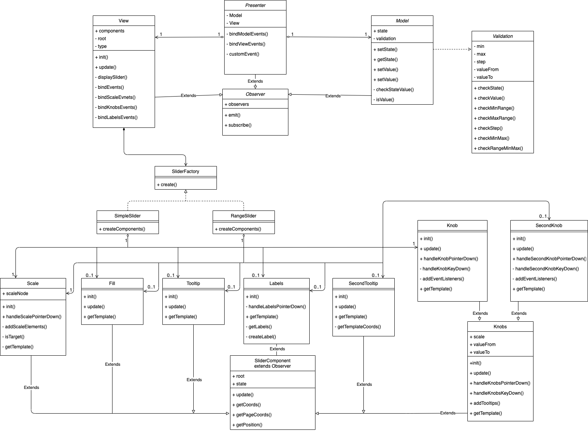

# MetaLamp 4 task - Slider for jQuery

Четвертое задание - плагин для [jQuery](https://jquery.com), в котором выполнен функционал «бегунка» (также называемого слайдером) - специальный контрол, который позволяет перетягиванием задавать какое-то числовое значение. 

[Демо страница](https://yarlykov.github.io/slider-plugin-jquery/)

## Содержание

- [`Возможности`](#возможности)
- [`Развертывание`](#развертывание)
- [`Подключение и использование`](#подключение-и-использование)
- [`API`](#api)
- [`Архитектура`](#архитектура)
- [`UML-диаграмма`](#uml-диаграмма-классов)
- [`Использованные инструменты`](#использованные-инструменты)

## Возможности

  - Любое количество слайдеров на странице без конфликтов
  - Простое и удобное API для взаимодействия со слайдером
  - Два типа слайдера (одиночный и диапазон)
  - Поддержка отрицательных значений
  - Широкие возможности кастомизации
    - задание размера шага
    - выбор вертикального либо горизонтального вида
    - возможность задать диапазон значений
    - возможность вкл/откл прогресс бар
    - возможность вкл/откл подписи шкалы значений
    - возможность вкл/откл подписи над ползунками
  - Поддержка тач устройств
  - Поддержка управления с клавиатуры
  - Подстраивается под изменения ширины/высоты контейнера

## Развертывание


### Клонирование репозитория

```bash
  git clone https://github.com/yarlykov/slider-plugin-jquery.git
```

### Установка зависимостей

`npm install`

| Разработка    | Тестирование |  Покрытие тестами       | Production сборка |
| ------------- | :----------: | :---------------------: | ----------------: |
| `npm run dev` |  `npm test`  | `npm run test:coverage` |   `npm run build` |

## Подключение и использование


1. Для работы плагина необходимо подключить `jQuery-3.x
2. Для подключения плагина на страницу необходимо взять из папки `./dist` файлы: 
    - `plugin.js`
    - `plugin.css`


Пример подключения на страницу:
```html
<html>
  <head>
    ...
    <!--jQuery-->
    <script defer="defer" 
      src="https://code.jquery.com/jquery-3.6.0.min.js">
    </script>
    <!--Plugin JavaScript file-->
    <script defer="defer" src="plugin.js"></script>
    <!--Plugin styles file-->
    <link href="plugin.css" rel="stylesheet" />
  </head>
</html>
```
Инициализация с настройками по умолчанию:
```html
  <!--HTML-->
  <body>
    ...
    <div id="root"></div>
  </body>
```
```js
  // JavaScript
  $('#root').sliderPlugin();
```

С пользовательскими настройками:
```js
  $('#root').sliderPlugin({
    min: 0,
    max: 100,
    step: 25,
    valueFrom: 50,
    valueTo: 75,
    orientation: 'horizontal',
    range: false,
    fill: true,
    labels: true,
    tooltips: true,
    color: 'orange',
  })
```

### Опции

| Опции         | Тип          |  По-умолчанию       | Описание                      |
| ------------- | :----------: | :-----------------: | ---------------------------:  |
| `min`         |  number      |  `0`                  |   минимальное значение шкалы  |
| `max`         |  number      |  `100`                |   максимальное значение шкалы |
| `step`        |  number      |  `25`                 |   шаг шкалы                   |
| `valueFrom`   |  number      |  `50`                 |   значение одиночного ползунка / начальное знач. диапазона | 
| `valueTo`     |  number      |  `75`                 |   конечное значение диапазона    |
| -----         |  -----       |  -----              |   -----    |
| `orientation` |  string      |  `'horizontal' `      |   ориентация слайдера (horizontal/vertical) |
| `range`       |  boolean     |  `false`              |   тип слайдера (одиночный/диапазон) |
| `fill`        |  boolean     |  `true`               |   заливка (от min до valueFrom либо от valueFrom до valueTo) |
| `labels`      |  boolean     |  `true`               |   подписи шкалы значений |
| `tooltips`    |  boolean     |  `true`               |   отображение текущего значения над ползунком |
| `color`       |  string      |  `'orange'`         |   цвет слайдера (orange/green) |

## API

sliderPlugin( *method*: **'getState'** | **'setValue'** | **'onChange'**, **options**)

Плагин принимает в качестве параметров объект с опциями либо методы для изменения и получения данных.

`getState(): IOptions` - метод, который возвращает текущее состояние слайдера в виде объекта со всеми опциями.

```js
  const state = $('#root').sliderPlugin('getState') 
  console.log(state) // {min: 0, max: 100, step: 25, valueFrom: 50, valueTo: 75, …}
```
---
`setValue( name: string, value: number | string | boolean): void` - метод для изменения любого значения слайдера. Принимает название параметра (`string`) и значение (`string`, `number`, `boolean`)

```js
  $('#root').sliderPlugin('setValue', 'min', -100) 
  $('#root').sliderPlugin('setValue', 'valueFrom', 20) 
  $('#root').sliderPlugin('setValue', 'orientation', 'vertical') 
  $('#root').sliderPlugin('setValue', 'range', true) 
  $('#root').sliderPlugin('setValue', 'tooltips', false) 
  $('#root').sliderPlugin('setValue', 'labels', false) 
```
---
### Кастомное событие

`onChange( func: EventCallback ): void` - метод который позволяет передать callback функцию на событие изменения слайдера. 

```js
  $('#root').sliderPlugin('onChange', () => {
    `any code`
  }) 
```

Также позволяет через объект `detail` получить любые значение слайдера.

```js
  $('#root').sliderPlugin('onChange', (evt) => console.log(evt.detail)) 
```

## Архитектура

Плагин построен по MVP-архитектуре с Passive View. Такой подход позволяет отделить бизнес-логику от отображения. Отвязка слоев приложения осуществляется благодаря использованию паттерна `Observer`, который расширяет основные модули и позволяет им взаимодействовать ничего не зная друг о друге. 

### Model

  **Model** является модулем отвечающим за хранение всего состояния приложения и валидацию данных (расчеты, которые относятся к бизнес-логике). Предоставляет методы для чтения и записи (всех параметров либо каждого по отдельности).


### View
  **View** отвечает за создание отображения, его обновление и взаимодействие с пользователем.
  Отображение декомпозировано на более мелкие элементы ( *subView* ), которые наследуются от общего класса `SliderComponent`. Это решение позволило создать единый интерфейс всех графических компонентов и расширить их классом `Observer`, чтобы на их изменения можно было легко подписываться. Также данный подход позволяет `subView` оставаться низкоуровневыми элементами и ничего не знать о модулях высокого уровня, но при этом всегда иметь доступ к актуальному состоянию для внутренних расчетов.
  
  Все `subView` имеют схожий базовый интерфейс, каждый компонент умеет формировать шаблон и отрисовывать свой элемент, в случае необходимости может навешивать на него слушателей и при изменениях сообщать об этом. Также каждый `subView` имеет возможность обновления своих отдельных стилей (без полной перерисовки всего компонента).
  
  Для инициализации либо пересоздания графической части существует `SliderFactory` - это класс-фабрика, чьи подклассы в зависимости от типа слайдера передают в главную `View` массив необходимых `subVeiw`. Это позволяет локализовать и изолировать в одном месте создание всех графических компонентов и передать их главной `View` для рендеринга, подписки на изменения либо обновления.
  
  Связь между `View` и `subView` осуществляется также с помощью паттерна `Observer`, что позволяет уменьшить сложность графической части, обеспечить простое взаимодействие, слабую связность и модульность элементов. 
  
### Presenter
  **Presenter** - единственный модуль, который имеет зависимости от других слоев приложения.
  + Presenter создает модель и отображение
  + Подписывается на изменения модели и отображения
  + Реагирует на сообщения об обновлении модели и обновляет отображение
  + Реагирует на сообщения от отображения о действиях пользователей и обновляет модель
  + Формирует кастомное событие, для того, чтобы была возможность получать актуальные данные либо осуществлять стороннюю логику при перемещении слайдера.

  Таким образом передача данных снизу вверх осуществляется следующим образом `subVeiw` ->`View` -> `Presenter` -> `Model`

## UML диаграмма классов


[открыть превью диаграммы в draw.io для удобного просмотра](https://viewer.diagrams.net/?tags=%7B%7D&highlight=0000ff&layers=1&nav=1&title=UML-slider-8.12.21.drawio#R7V1bc5vItv41rjrnQS6am%2BAxtuPMHjtznMS5eL%2BksMAWNgIF4diaX3%2BaSyPoC2oQDUQwlaqxkISk%2Fr61et37RDlfvX0IrfXyY2A73oks2W8nysWJLMuGJsP%2FxVe26RWgqdmVx9C1s2u7C1%2Fcf53sopRdfXFtZ1N6YRQEXuSuyxcXge87i6h0zQrD4LX8sofAK3%2Fq2np0iAtfFpZHXv3u2tEyu6pr6u6Jvxz3cYk%2BGuhm%2Bsy9tXh%2BDIMXP%2FtAP%2FCd9JmVhe6T%2FcjN0rKD18Il5f2Jch4GQZT%2BtXo7d7x4YdGSff%2FP9rt3%2Fax%2F%2BPvT5pf19ezq9p9vs%2FRml3Xekv%2B60PGjxrf%2B9%2Fnh8q9v6tOP9c3lp1fpw7v7v2fZW6TflveSLWXGjuQHR1u0wJtXd%2BVZcGmUs4fAj75kz8A1OLM899GHfy%2Fgl3NCeOG3E0YuxOZd9kQUrOHVxdL17GtrG7zEP2ETwXVHj86WQej%2BC29refApAC%2FAp8Moo5msl17xJX4nvCzBq6Gzga%2B5QesC8kvX1ibKXrMIPM9ab9z75AvHL1lZ4aPrnwVRFKzQjWICOHb2KAc6eRCFwXPOqvj9nGhkqMWr4bwVaJqh88EJVk4UbuFL0LOSlMGRiaGRPXwtUjq7tiywWVayi1YmRo%2F5vfOP%2BwzFzvIf4SLkn5e%2FDUm9yvt5evnjLA8C71uRcxYv46bIQvhH4afuLiXcrMFTQPD0RD5LKAo%2FlmArXPCowEzPeYiYvNysrYXrP14nr7lQd1c%2BZz84vhTA9z54CSeWrm07fsIZ%2BNlWSquYKOvA9aNkRbQz%2BA%2Bu27l0qp1o8Audw8dg9xj%2Bi18eRueBD%2BlluQmPHMjZVyfmLYVhlcK7n2HbMnB7Aa7gUwnZujDKBIyz9KFrW5Eb%2BEeHZIViWUYrL%2FtTFN5q33irFLHFEPbcZFfJVgNQNe4e%2BFcQyPh2CO%2FbmA4XM0BwQiE5oVDw96x7x7sJNm5CSeUiTF%2BL8aIvIdY5QTUEYaqxVLEDzQKojf%2Fnf09iPaOAHbOPSKBFoTpXm%2B29TWD9jzGzHqC%2B1bTr7ZX75euPV%2FvnDEgKA9jHCdgDgAVSQ6uqRWRpajgT2W%2FxtQnZRshym1PikK1QxhOyzZFFAZEekdWppvJi6SyeE208wdsc3rnRHbyS%2Ffvu9een2zvrMvyuXHnez9vPM3lORdfdTKg2d26lDk0o6lcmRfab67wSADJiadIUS2svlpbHzuqG0sxGoTSAhdIU7s8TGkqjby0yydPUaFgEq3XgO7GgH5vSaTUOo3OzcShxN%2Fp2k6Qujg1pURj2HkszqBhG2%2FXxxb%2F7lVbeAJswpE2Kfp6ipoeBavQcNQWsDJbru1Fs8B%2BZCIvC0ew9TiqTijhF8mVtZ1HSCUvOAFrvoVGZ1LXxrmq7m7Vnbb94ru2EE6L8iHJbScIQRZ4Yhui969vvf8e%2BzQRnjUBZ73FQRWbCmdR%2Fvf%2FtOxOmdTA1Owx%2BMjAlM40I0ys%2FuN9Mclo3viD3bhUpZI4RYXodOwYTqLVB1fq2jsid9P%2FuN04IfwIB4lQfKj6mrYMs24sIMqcQZE4hCKiKVLCD2lyfN5SgNkHV1CcLMsIeX0SbZFmlDB8Uq6aRqo3oF%2FUbTzWD7YNKc8tooLYQ%2FaJ%2BYVaZirMaSfCrHRg1iplHlU1RFoHJrMN%2Fud8sQvd%2BHOGvdtCk5Yi7RdMksHLsRwcZb0krFG77wHVaBo%2BBb3nXQaIyY4355ETRNjPHrJcoKOtm582NfhT%2BvotvBdc%2BfXTxlt05ebA9YeV2qtZ8E7yEC2e%2F%2FoFW46NTdb%2FsdfEqVCIYOh586%2B%2Fii4QUgYEJoEEDNCcT6wRiDQDZIZrYI8ni3TihC7%2B1E35JFWKGw9PLao34YIUL5Bu9i5sq4SXbtVaBb98uXR89del6OfC%2BjV4YrBM1Cq9kzyeI%2B3CVfuzYED%2B8Kz6340byCJEjhZHxjRHbdgy7K3CPl21VLlWRbVW%2B%2BH628dIt0%2Fcz6dRQJbnkNc2QF8VNyez2N%2FEOtru3opW9MRVgBnhGk%2FRdO2ITNwIoroCMCgO7UYYe%2B0bohcHDw8YpvQayydoWXpHtwuwfpZe%2Fi6pKld9dkytfD%2F9Iv0GrviUp42le6ByVSxWqNaGp4yQurrQLlbBLOXusBFSlsURNlLLcmDppduXObClqYsp7ZZQSNVEw8TKa9n90EDVhZbJHUhhWKe38vjUnn4QFTIBCKxgaU3d0O0DyKgZxQJIBdwK8sYe%2BaqNK8bKpqIoKfQGZIZwjKhdqCUkycU2XzzbiJe7N0z83%2Fl9fr35Y9uzj%2FOWD95mSD8sbZM%2BDILTHkd1sB0wAyFhmt2iyQpmx72M9OhOidRHlNoREIcoygxJvNt2eJjz58aTUwYvDk27YEoCmM78G5EePpvpALbu1c4q1zMgTN%2Buowz5uyA11zCb8mKz%2FBPbxuWBNG3Sqxbz9GgVhmonWQjl5agfCSpu60GWVAlBZg1JG06TTEpLcm4MwAVVZSnlp%2BVCmEjsiSS444UXwOmK7sD64tFY6UeCu9Sfw3yfHPv%2F16%2Fnt8tPi49fwbUYvH7fsrCPAc1ZHXWpMIMWNcoU3zql6BQosayTKbZKOPFo0BQgoUCgtHh2jSR9fBIG8dVZrb9SBzwaA6n0X%2FgEytpLUiUyeeA%2BzbTQOV5zmGzfsA8iZhjLolNDtUHxx5IdNjhmHLLc%2Bv0aUYyZPflk7QCq99wmqNAGd0qFNwORV%2BwLBrBgZPNl59RHlHVIjDFGZjJokHdmTndfHeSCyapYML4M2joHqBmgVOzHb0JMxQ88YRsMnNQZEmaBKkLRQ3p61ShSbHkqV7qWi%2BXsviClVKpff5TOwYnAORZBKFYlzYVk1yqqia4cWjoMSqOgMjrpl4%2FhtNOw%2BjKrx1vAma1Xfo1prHHYIUDJzoAz4Xr2UG%2FWJzmBuHRdVgbjsgKvszSd5vrzIkQo%2BV3UWyAqam5F3FhzGD3YZf2veGGvS6Iaaxh%2BJXZBvsoPsyaayk5VMSS5chnDfPDYs62S4mwTkWXtCzYZtYbXI1P01h%2Fw2GDXgAkScNnS0W8BpzSBT5OxAWHlzpeJKGqg9PuOOm9WHkTZ1tNv8CzK3p7jZwWBSx452nB6llyqfyyfvsgKVJOwyFag0A5jbehInrqzIaAHdK2c7IVsTWe4ImKjaI5ZZbNn2bXbi9dECKsDPoU4j7VhUKxqBpiRGg2AFbRhpp5AqJKJfnEWQTpclgJxSGR2kMvBBHzogbbC8U6REEnzMSbNUBgCUDxxK0Qpldi7B0rG73go%2F59hBUyrDhLneGiv6PW7vuz6SlKoVuq4QZyOwzL6xe9%2F1waRN2egYTNbYm6w1JDcVJve7EcKUmGfXCNNPdcHxHb0DXh9bWqNIx%2BAiBUK2%2FyRHDFy7m8jxnfB43XARsFI6RrqGdXLD24WU0jPSLaQKaTRlITICxckH72CAA%2BaCi24bUYdZTUg%2Fc2CavLZfBdWeINN32wjQZcaeMnIPvDaS%2FfeN6KyE2ug98DbmXHYNJqufa7L1GiHae98IpREodbMng68%2Fg8%2BUmhp8WjODzyh%2FHpCk%2BXAtvmmC015FpLYymKtbi49VqT5ui68%2BkgOw%2BFjps7FbfPXBHIDFx0qgTRZfI0S7tPiodXD0434LaB75%2FOQmtXBqgyFc3ZrxZN4sPbx5st%2F7OLlmzmG%2FU8%2F7nTey33V8rtCAZ%2B5S2yEm850uza33mYoz31kj3Eduvrcy6Kfbsuo5fUpnWoOR7ipTfU0jbPsfros%2BbbLm20G0y4m6DETJ6ovMnk9FdULzsBqpruEkzaMYzkXoQMlMEJ0A%2FZPm6WpkWDM9g%2FTSWkRB9gGTf9ZxQQ12JIrKW%2BCiN3LPFMwdVM0Bu2fTMIm9ekhrZQxQl9kVSuVtaval%2B8p4t5T6UHKnV0SNe6EE5D9DheOk28q0n%2FSwn2hmWcFrhiZyP9F0%2FOOGu59QHc5pP6FL9B%2Bzn1C8lOJ%2Bch6s1oF%2F1Ee5CAC1952FEvj7BmGyrUQIODcWedpY2ttYgIypeuoEJBpJFFDh0bK3FlnBPo9yNOxgthZ6Jnvlklwdic6ZCyv7EqdzyPhIAqL1dnQgtjqnsj7UtNFa3UJNP1lqEzlklfGE9UFY02aSdoo1kOiHwk1jhwUhzl1WJg5xMnKYIz5NHW4bbyD1Dfic4xyHsXv2DXDt3bVnzVhZLJ3FM3S1xhwuboBn%2F%2BX4gBaCyxH9Fl%2BdEK0znqH3mnzAmriRIPrR9ZOEwARqDVB7b8TMa08YoFpvE6h1gxu9l%2BUDwGp%2Bz3ZTZz0BWgNQWjlPx4CyGuCR6oWCOkFaJwDZv33E6jxNIE207oRrbVyb1ji1hqthEGjF58uhPFV2rmDZjYcrtQweA9%2FyroPEz4zdzCcnirZZ5sl6iYKyQ%2Bu8udGP%2BO2ncy17eJfdLf774q34YHvCCgtU5YvSg%2F6qKJwVRqYn%2BXG8EDsJkUSR%2B2S6A0WPjCHchM4mTRvi6E0Jxw4611C4CCUNeAdPmDKbIxWNaw0%2FrodsIwD0%2BObHwHa8se4LOwH%2BczKOID%2FduQzkN9d5PTocW41SN0C796RjXjAxhalbBZY3wyis4RTBiEnxvevbiUpORgon9WfwmypgR%2FMjkm5x8M5798pkehdqjG%2BsqSd4D4EXSH17Z0CmV28tXjbQJE7QncBtCC63idUCuJL9%2B%2B7156fbO%2Bsy%2FK5ced7P288zCrYEfo5vvwvDZLmDdbLYtrVZJqYKoHvY6O%2FEvT5FzjbdwYaLGm7jN82kU0ky0JX0rZKGHu%2FenDzavdu%2BdD2v%2BNyNE7pwcWLn8kAP%2Ft%2Fnh8u%2FvqlPP9Y3l59epQ%2Fv7v%2BeoWO69zrwqFxurwNfwF6jQI%2BuNT2BHnUiYOWimorZcekPz961YxV5I2wCYd4ih26UrgxxowbeHZ2xtBggm7G2a63iGZlL12%2Bbq2aZq0a89jXImkQtMMFKrnVM6Pmgeao05akOjFN0OlSe4ddOlbks5f%2FNu2UuxzhMUtfSKAvJp5Roa0jqHuIymVcWECoBfxQfFOSkiurw0w%2FjbVHBUnkrD4q3c0M6ReeA7wpKTk1JbUbfuVK%2BmSLp3ZKVo7u4QNZ7L4jjrGzLIOfRjjp3xee4VGZzBlW2lA6EQhoWYtXwnsOmW%2FQcn1Ummju0CVNs7mT5nX1G5W5z7jxrg87NGQpRsD3SwGNy3ETB21NxxjGIApGztoWXZc4W8wvjYxXQ5%2Bx4l96xVRaiRToeFg7bUhs8C%2FFZj22zsFJ1FKfKuKu1Nw0BwLMc3aVO5W6HAACcdwM%2BpIl6aghG0bHnYHR%2Bwg1kCABQWHPepykAzVHtcgoA1cLhOV%2BDKxQ2ROdsYDY3bsLqRkNrZ45ZO4bCZ%2B20ZRarHM1gpFlcUvb745b1uDAQiHGvuan7vZcqLdmzBv1jhDpVlOn19diz86NkE8UsY10TR9SBXOlOcQXMKXHHss1Zj5p7nTK0IAPh8Bxg2qWpmuqKxHO5BxajxS6wGOG9o3Hi4BRMEmQAIdsSt4DuMz8nNUbPoPP0mDDvPPCCcCcLiVeXOlwJ3203hC5DarZCcGKO1OToIvD92Ou4R98c%2FTpuh4gAu%2Bpwg4NMFo10h3tb%2Ba5X2cTcztwqb3%2BVZWKVpdNT%2FoVm2Ph%2FyDrjhyITG3l760xWPo2GzQDbaeYcBxpiun%2BmKOXNqnyD4OFh4wixgTUyyjEi%2BcAnlQmUD7JWYzTyYeLz4EBt%2BQCIp3nAujsJqRdaqLTz%2BRMm7buW3A1ZA7HfVYw1Oq5Vee13PMbNa7%2B3RiAyzDAa0ccTTQLNabJKY0QbmW52tpHVC3tQSrd2IVa5FGPdRVXpMdaSSszWnSzSEhiHVQaWdZb26DXurDNmv6odx2Gpg%2F7ZlPrDgvfDIg1xymPTUoU5VvOgc5YqtEYa2jihRnoIlJTQ%2FnpOkWwBw6rD650tdWOo%2BCho9IWZtiH%2BetPEyCog5qqPOFZCeNx4z8SAYyXUI%2BKbqZxTSSptUUnOx6yleVpoiNirjlBP1EDUkYofGdyaOsJbK1pSR8QXNtUO1Avpb47IE1LlGgrmIE9Ir9cXUOkJGZJexxWiyn59%2F%2BiQdPBAVIKOjhI9VCUASTZPzXKXFOFFt6QWgFRtpgjSC4d77sT%2BQ%2FG29nF3R7r6ha37XfRhsZMJdH16KtjxjxoeDhXFTaw2nHwDHqjtpKWB54gufltsjtti83oNrF3YYkCXB8VtHbfkm1Ibn6fF26NVu%2BmBcD3kDnhKhilGZIzp8hxbclHGGPVwtxY2N0BohvlezXCwLsAknEs5mH3qAgMvGG28zeVjwlmMaatiFP%2FGnSgDMvAzImVgEM6wMGUw6qIWIGP5HB2Xxv0CLcvlGNsMzQQXH2WjHK42JvAkLKsnLpNLOdqsastEcw2YeyZP%2FOGgfbA3Lw4zUM2m7RA6FrkGRCVUW04c9o3zDxK7vZGBx%2FdvkYP6M%2FGh1texIJYJtbevN%2B%2BWxKWfbG8kqVYtBbiIsqSZKbqzeJq2qh5GOfH6FRk%2BzevZWkmzt68t2hsk3lEfHX5sLaENuDtUMGPW5IwNtUYp0skdvuAbrL25tuBLp1DfKoOX%2B3oecidyj2wKwYI%2FtMIttS3BN9SeBZ90aP8AwUeC0MaOD7U47ikNXhEcXNA%2BxDq7oXWfooaPQ30GonlC6niEmVFh1ete7Grfh%2FCvx92AiWFKfWt2PtzuDVBGd%2FhCb5JW%2F2hqznQsHiau29QccU8vngYWuMqkJTuaVTakzlaZNBOYtp0Qa6HBmEHhrsbeJjqJ01zJR%2BQPxF7RsAYiBbcyuGOcmEui4MkHweaKWW%2BoDy2q3WgcOqM0CqstiUMF%2B0tLDk4g7%2B%2F1VGQq%2FTiYyzCOOqoAVrVTzSz8V%2BKabCinmkE8W39euo7dttuB0yZZWDp8r9pkHfnRxKuWFDQsHEFwGHs6sK%2FbmwZlmvOS5onPeq3UPZRBT5UaCOxvcdpXXtzfbkofs32kmyk%2BJ0fu%2BISR%2FMilP0sVIVlswdWXdFDeYwbl6q%2F1J%2FDfJ8c%2B%2F%2FXr%2Be3y0%2BLj1%2FBtRmqiKz%2B4J%2FCaxivj45UpfOHTZOxqDjwRn4ciipNSDYomkjlmpFAGLMtYw%2BYutdDvhGUqUQHpxxMsPfIJy3sox5ZvknLbMo77CNbCgGU6qGRKKJ2v7PpudLQzldvHkTZSmaooWoj%2F0IGkzT%2BPgXxZ21AtTFByQ6nz6nxhUNIOiouhXFo%2BVI2xeZCYJ054Ebz6E7LcyBqcylYcsmSQdlbC9crZTpjWwhQgs6Q%2FUMkQZgyqZdvJEbPX7gZ6YE54vCcUCAAVnSHXH6i0bvFYB0P%2F%2FdZZrb1pT60FqN63fSSToRECvT2JsYbJKiJm3%2BL4oV7jZgZWNNO8MA5Ic7OUCij3IeoaODUAM1HQVhU%2BwJO1bZfh04k5wGpc7lAch2LYG7Obq1IZ7iFlD%2Bg%2FiSMSMihd0peGMA1WfKt2aB2vmedsxWkN8gGWzrYqpXKllA6%2BdJb6o5odpDlCOQV4S4rRNAVG3klcQQkd8yPfTpU%2FvMad%2FqMO3VB55q%2BXU0y7BL4klUuHFAM95k%2FgHyT15cx6RXS3N%2FUg4XPB8cQ29yQ%2FxqFJh2sH%2BDAMgqj48tBaLz8Gdizf7%2F8f)

## Использованные инструменты

- [Typescript 4](https://github.com/microsoft/TypeScript/#readme) 
- [Webpack 5](https://github.com/webpack/webpack)
- [Babel 7](https://github.com/babel/babel)
- [Jest 27](https://github.com/facebook/jest)
- [jQuery 3.6](https://github.com/jquery)
- [ESLint 7](https://github.com/eslint/eslint)
- [Stylelint 13](https://github.com/stylelint/stylelint)
- [cross-env 7](https://github.com/kentcdodds/cross-env)
