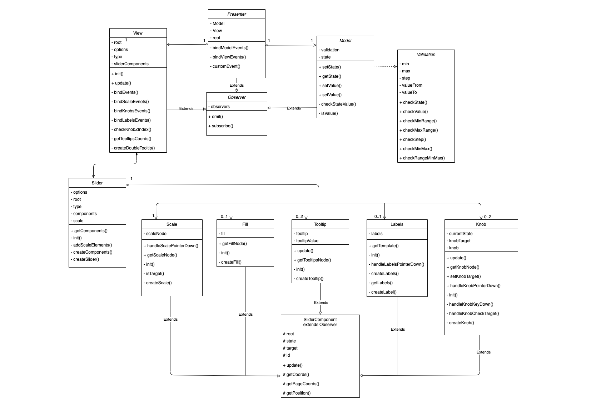

# MetaLamp 4 task - Slider for jQuery

Четвертое задание - плагин для [jQuery](https://jquery.com), в котором выполнен функционал «бегунка» (также называемого слайдером) - специальный контрол, который позволяет перетягиванием задавать какое-то числовое значение. 

[Демо страница](https://yarlykov.github.io/slider-plugin-jquery/)

## Содержание

- [`Возможности`](#возможности)
- [`Развертывание`](#развертывание)
- [`Подключение и использование`](#подключение-и-использование)
- [`API`](#api)
- [`Архитектура`](#архитектура)
- [`UML-диаграмма`](#uml-диаграмма-классов)
- [`Использованные инструменты`](#использованные-инструменты)

## Возможности

  - Любое количество слайдеров на странице без конфликтов
  - Простое и удобное API для взаимодействия со слайдером
  - Два типа слайдера (одиночный и диапазон)
  - Поддержка отрицательных значений
  - Широкие возможности кастомизации
    - задание размера шага
    - выбор вертикального либо горизонтального вида
    - возможность задать диапазон значений
    - возможность вкл/откл прогресс бар
    - возможность вкл/откл подписи шкалы значений
    - возможность вкл/откл подписи над ползунками
  - Поддержка тач устройств
  - Поддержка управления с клавиатуры
  - Подстраивается под изменения ширины/высоты контейнера

## Развертывание


### Клонирование репозитория

```bash
  git clone https://github.com/yarlykov/slider-plugin-jquery.git
```

### Установка зависимостей

`npm install`

| Разработка    | Тестирование |  Покрытие тестами       | Production сборка |
| ------------- | :----------: | :---------------------: | ----------------: |
| `npm run dev` |  `npm test`  | `npm run test:coverage` |   `npm run build` |

## Подключение и использование


1. Для работы плагина необходимо подключить `jQuery-3.x
2. Для подключения плагина на страницу необходимо взять из папки `./dist` файлы: 
    - `plugin.js`
    - `plugin.css`


Пример подключения на страницу:
```html
<html>
  <head>
    ...
    <!--jQuery-->
    <script defer="defer" 
      src="https://code.jquery.com/jquery-3.6.0.min.js">
    </script>
    <!--Plugin JavaScript file-->
    <script defer="defer" src="plugin.js"></script>
    <!--Plugin styles file-->
    <link href="plugin.css" rel="stylesheet" />
  </head>
</html>
```
Инициализация с настройками по умолчанию:
```html
  <!--HTML-->
  <body>
    ...
    <div id="root"></div>
  </body>
```
```js
  // JavaScript
  $('#root').sliderPlugin();
```

С пользовательскими настройками:
```js
  $('#root').sliderPlugin({
    min: 0,
    max: 100,
    step: 25,
    valueFrom: 50,
    valueTo: 75,
    orientation: 'horizontal',
    isRange: false,
    hasFill: true,
    hasLabels: true,
    hasTooltips: true,
    color: 'orange',
  })
```

### Опции

| Опции         | Тип          |  По-умолчанию       | Описание                      |
| ------------- | :----------: | :-----------------: | ---------------------------:  |
| `min`         |  number      |  `0`                |   минимальное значение шкалы  |
| `max`         |  number      |  `100`              |   максимальное значение шкалы |
| `step`        |  number      |  `25`               |   шаг шкалы                   |
| `valueFrom`   |  number      |  `50`               |   значение одиночного ползунка / начальное знач. диапазона | 
| `valueTo`     |  number      |  `75`               |   конечное значение диапазона    |
| -----         |  -----       |  -----              |   -----    |
| `orientation` |  string      |  `'horizontal' `    |   ориентация слайдера (horizontal/vertical) |
| `isRange`     |  boolean     |  `false`            |   тип слайдера (одиночный/диапазон) |
| `hasFill`     |  boolean     |  `true`             |   заливка (от min до valueFrom либо от valueFrom до valueTo) |
| `hasLabels`   |  boolean     |  `true`             |   подписи шкалы значений |
| `hasTooltips` |  boolean     |  `true`             |   отображение текущего значения над ползунком |
| `color`       |  string      |  `'orange'`         |   цвет слайдера (orange/green) |

## API

sliderPlugin( *method*: **'getState'** | **'setValue'** | **'onChange'**, **options**)

Плагин принимает в качестве параметров объект с опциями либо методы для изменения и получения данных.

`getState(): IOptions` - метод, который возвращает текущее состояние слайдера в виде объекта со всеми опциями.

```js
  const state = $('#root').sliderPlugin('getState') 
  console.log(state) // {min: 0, max: 100, step: 25, valueFrom: 50, valueTo: 75, …}
```
---
`setValue( name: string, value: number | string | boolean ): void` - метод для изменения любого значения слайдера. Принимает название параметра (`string`) и значение (`string`, `number`, `boolean`)

```js
  $('#root').sliderPlugin('setValue', 'min', -100) 
  $('#root').sliderPlugin('setValue', 'valueFrom', 20) 
  $('#root').sliderPlugin('setValue', 'orientation', 'vertical') 
  $('#root').sliderPlugin('setValue', 'isRange', true) 
  $('#root').sliderPlugin('setValue', 'hasTooltips', false) 
  $('#root').sliderPlugin('setValue', 'hasLabels', false) 
```
---
### Кастомное событие

`onChange( func: EventCallback ): void` - метод который позволяет передать callback функцию на событие изменения слайдера. 

```js
  $('#root').sliderPlugin('onChange', () => {
    `any code`
  }) 
```

Также позволяет через объект `detail` получить любые значение слайдера.

```js
  $('#root').sliderPlugin('onChange', (evt) => console.log(evt.detail)) 
```

## Архитектура

Плагин построен по MVP-архитектуре с Passive View. Такой подход позволяет отделить бизнес-логику от отображения. Отвязка слоев приложения осуществляется благодаря использованию паттерна `Observer`, который расширяет основные модули и позволяет им взаимодействовать ничего не зная друг о друге. 

### Model

  **Model** является модулем отвечающим за хранение всего состояния приложения и валидацию данных (расчеты, которые относятся к бизнес-логике). Предоставляет методы для чтения и записи (всех параметров либо каждого по отдельности).


### View
  **View** отвечает за создание отображения, его обновление и взаимодействие с пользователем.
  Отображение декомпозировано на более мелкие элементы ( *subView* ), которые наследуются от общего абстрактного класса `SliderComponent`. Это решение позволило создать единый интерфейс всех графических компонентов и расширить их классом `Observer`, чтобы на их изменения можно было легко подписываться. Также данный подход позволяет `subView` оставаться низкоуровневыми элементами и ничего не знать о модулях высокого уровня, но при этом всегда иметь доступ к актуальному состоянию для внутренних расчетов.
  
  Все `subView` имеют схожий базовый интерфейс, каждый компонент умеет создавать совой элемент, в случае необходимости добавлять слушателей и сообщать о своих изменениях. Также каждый `subView` имеет возможность обновления своих отдельных стилей (без полной перерисовки всего компонента).
  
  Для инициализации либо пересоздания графической части существует `Slider` - это класс-фабрика, который в соответствие с переданными опциями создает все элементы слайдера и формирует объект с созданными компонентами, после чего `View` может легко взаимодействовать с `subView`. Это позволяет локализовать и изолировать в одном месте создание всех графических компонентов.
  
  Связь между `View` и `subView` осуществляется также с помощью паттерна `Observer`, что позволяет уменьшить сложность графической части, обеспечить простое взаимодействие, слабую связность и модульность элементов.

Помимо прослушивания событий `subView` в классе `View` также реализованы некоторые фичи слайдера:

  - метод `checkKnobZIndex()` меняет свойство `z-index` у ползунков в зависимости от того, какой из-них задействован в данный момент;
  - метод `createDoubleTooltip()` отвечает за то, чтобы у двойного слайдера ползунки объединялись в один общий;
  - также во `View` реализована возможность перехвата `target` со шкалы, чтобы после нажатия на любое место шкалы можно было сразу передвигать ползунок. 
  
### Presenter
  **Presenter** - единственный модуль, который имеет зависимости от других слоев приложения.
  + Presenter создает модель и отображение
  + Подписывается на изменения модели и отображения
  + Реагирует на сообщения об обновлении модели и обновляет отображение
  + Реагирует на сообщения от отображения о действиях пользователей и обновляет модель
  + Формирует кастомное событие, для того, чтобы была возможность получать актуальные данные либо осуществлять стороннюю логику при перемещении слайдера.

  Таким образом передача данных снизу вверх осуществляется следующим образом `subVeiw` ->`View` -> `Presenter` -> `Model`

## UML диаграмма классов


[открыть превью диаграммы в draw.io для удобного просмотра](https://viewer.diagrams.net/?tags=%7B%7D&highlight=0000ff&edit=_blank&layers=1&nav=1&title=UML-15.01.22-slider.drawio#R7V1Zc5vKEv41rrr3QSo2sTzGdpzkOMl1Emc7LykssISNQEHItvLr77AMAqaBATGgCFKn6liITfN193R%2F3dNzJl6sXt54%2Bnr5wTVM%2B0zgjJcz8fJMEAROVND%2FgiO76AjPCVx0ZOFZRnxsf%2BCL9cfEJ8ZHt5ZhbjIn%2Bq5r%2B9Y6e3DuOo459zPHdM9zn7On3bt29qlrfWESB77MdZs8%2Bt0y%2FGV8VJ5J%2By%2FemtZiiR%2FNy1r0zZ0%2Bf1x47taJH%2Bi4jhl9s9LxfeIfuVnqhvucOiS%2BPhMvPNf1o79WLxemHQwsHrLv73bf7feP8pt%2FPm1%2B61%2FPr28%2FfptEN7uqc0ny6zzT8Rvf%2Bs%2Fj%2FdXbb9LDj%2FXN1adn7s2ru38m8SXck25v46GMpSP8wf4OD%2FDm2VrZOhoa8fzedfwv8TdoDM5121o46O85ejnTQweeTM%2B3EDav4i98d42OzpeWbbzXd%2B42%2BAkbH407%2FnS%2BdD3rD7qtbqOveHQAfe35sZgJcuaML8GV6DCHjnrmBp1zg8eFTw691zd%2BfM7ctW19vbHuwhcOTlnp3sJyzl3fd1f4RoEAmEb8KQE6%2FOB77mMiVcH1lGjEqAWjYb6kxDRG543prkzf26FT4m9VVY4uSbQwvsVzWqRjxJYpaRbE%2BKAeq9EiuXfyuM9I7XRngQYheV5yGX6exFE%2BT84%2BTrcR8I7um%2BfBMG7SUoj%2BSP3U%2FaFQNmvIqUDI6ST6aBm6b7kOIbBozP2UcNrmvV8ompu1PrecxfvwnEtpf%2BRz%2FJuDQy669t4OxWJpGYbphGLj674eSVYgK2vXcvxwUGbn6D80dBfcdHY2Qy90gT7z%2B8%2Fov%2BB0z79wHSRhuhWKkonE9tkMRLdMIpf%2Byo7%2FJEWxVMurRXGXRbhSEkoELyMCdfHmQbyRWfDNk4OaFYhS3yBKBIgEdrYVzimxSPOgva0AdoUgCm6HkbwNgL6c8ATaIom2CCBr63emfeNurNCuiJdedG4O8b5AlSlBVRlhOgMwPQ8wNZFTgLTzP%2F89C4yHyO%2FN06iqlagqUrOZtwms79SJfo8mzdns%2Fe7a%2BvL1x7Pxa8JzYgGwixHYA4DluYY%2BVYvIQmY4VtlvwbER2UbIUvtI7JAtMcYjss2RnQm9IyuD%2Fu98ac4fQ2s8wtscXkXtDl7OePr5%2FOvT7U%2F9yvsuXtv2r9vPE0EB0bU2I6rNI1auQxcKfGVSZb9Z5jMBYAGTxo1MWntMmshlmTSV0gkTpZKwqZhI43NEmkj7vB6INNj0hCT2QE2NTC1dx0KOqSCG7jogLDanPHm0SorWxr1LPu16q1%2F%2B%2BfPp3ePFlX3jvLr0f%2F%2F8XkCC%2B7v16XGidZAmEKQF%2F2CSrQ2k4QBAgAOAjW0ZpnfhrtauYwZjPWTc29dwtW%2FLrhGoEwgPnTGvDWoSTPdFmfNkMiuiaSzH8oNo78R0mBmQfO8suUC6XhGU27URc%2BQjmHRgNi02aA9MHLXl5tg7yzFePwWz6wgnPZzULhM7OGH3OIAzrBR7%2FeSYI6Z1MNV658FFMiuJMb123LvNqKd1uQu%2BQ%2FK7AFMyH4kxfR84kiOotUGVOnSMQGYCVtMwXRXo6b%2FvUFD3crKItk9ACEqH3hGIKKykC9O%2Fjeu6L1zXM05XSxlgqnXoIoGYkuUCoZZ6JgpdLt0tGs0Y3BFValRFTNH0NqGSUcz%2F7jamh34qAeJYxc8%2B9zhT4hRbki0CTLkCCAhfxioWJx9lfpZ9XtOpo93kI%2Bz7gQbIjcX19NhsUsZKNfigDCQkUszyE2Nld%2FugQulFCNQWaGrwhYuKCc3VQFjqdmCcAbEYqJus%2FAGtKN2w2d5t5p51Nwyauh00oUqebtHUCKxMY2Fi1y1crpr3fNA4Ld2F6%2Bj2ezc0mYHFfDB9fxc7Y%2FrWd7O22Xyx%2FB%2Bpv38Gt0JjH326fInvHH7YnRVlYcvGfONuvblZbX%2BQz4iizOrzglEoRdAzbXTpU%2FokJqW6%2FAjQUQOkkCVvBGINANkjGvoj4eDdmJ6F3tr0vkQGMcbhYbtaY3nQvTmOjF4FC9%2FRIcPSV65j3C4tB391ZdkJ8I6BT3TXoRlFR%2BLvg5tHcBQ8GUsNN5WUWUpy%2BCnHC6Wyg0TG28WXijw%2B8DP97f7C8FPmyuR9UvfOHyPFsywCS4tnGbtRLZ608hlPEBNuqkqckAmyJjjoopbh%2BPY3wZS3vzeK3jL3lQRlqqX%2FZW8YS1l0j71eVN8WOyX4RrHQFN8In%2Bje32%2FMzDlIGPVd6ox4Ei%2F8iaKaHTpJ5uq9e%2FZ89Ef0Bq0GpqSJ%2BJKttEpVVSJPyQzjY27PsxSXXPZY7i1xA6FclFzjBFUVCa8tiYWzjROESo0FKBdxlq33Vpsu8uuAcoEKVsSzwVR8l2o7fWhO4gvLE7N6UBGqDBTPhtMSoR0gAS6WGZA77Y1yrb97%2Bsr%2F2Cj%2Fm7sfNtfLxG8gcIzdlhHIxnE5MyDhWnyIAhWjq04TxIrcWTGuJZW5vdtVMnlGoDd0Iru2biaJrCpYWTHZvACgOrAq3bagJMvFYA1tg%2F%2B0bh4%2B3jhvv17%2F0I3JB2X7xv4MZLcjM4smyxOvQGGAJpCb6BZNKDURo3mjL8wR0bqIUvtBrBAtiktCeimaoEY8a3QxIJPA7PCEI00C0KjP6hERW4OpJRK1LLEl87SFH7xULB%2FFxBZ2h3FXsuPoYwDLKVzMuAlk9aNrnB4l0nRlbLmWt19yxMwwkSuiCYyHHqrVhxVqddVl0REvFZUdLXUHARHOPWGGyPQu3ecB%2BxL1saUtPG1DZUGyUyjrKYkN9YjoYf0JujXCErwuZDAr2VsCkucp7S5DJIua0N2GmYgRzRpoisCiyo7RLGgYGa7tCW3tCGid1ex9F%2FHyJK8S1nyNUXj3UbjMUUThUFjMNysvSSQtfp7WtO9Ju2E47OLB%2FsA9JKtDMTcatYD10FAQfGUcSo%2BxdZuw0vYLZBdbQ7DG8Vcwmww8%2FKoNKLS0p9OlvgXWduDRV20cm9LaLWpmQcOM0F0PVHOEk0GDP3Z6SZKYQduT0VvvwVvnk244Je66gLfOyHT%2FFholzYScu64exwJ8uPwUXoE%2F33oBDF%2BGXEuc6PAhbjsoV%2Bzcdpj0eUSm53bQ5cT1sQR8dWZYruUH%2Ft8H07j4%2Ffvx5erT%2FMNX76WgN88jNIv87SC2msmuDzXQqbJjtYXW5IzR9oGwArkxEFZm0TZOpY9VxwdjqQF1qqCKsuqUBhJiMXMSePYnzZw0WegRYVxvSUC3iBbVImwiRE8868kCU2qfiRmNMisCNSoeCnAda4caWWBeEfoGV4K3ORo22dkASQ1YwsMKSZh0gIHc6%2Bi1uRv1syb3IHToIsGZX3j3hD2qF0H35xOfVlkgO%2BvQVQKpCLgwLMpNBMCOaNZAU%2BnbSRJJOOMuzwSKY3qCfXpC5ZsWEymN9iaV%2FqbsBJwV9QvEdSBGR6y%2FirDDeiIYSLhOIQYy3OV6RPMYtx2Fmz2PTTIYwEq7YRYzvlouIk%2BGzlfXx1LpsDAMNLjA3mcJX403bDlpzpoBqFB3oo7LxGQS1pECa4AktUPEDknYI4qC6lPfdYcFpNDC5U4hlcgVOtH2dQSIY1jdQdUfJ1DE1XCrjBIJKY6r5VwP2CPplQHnPmGq1obF9TRsTpOEZ6TStcLqThcFghUmYyAGm%2BW%2FpwWGAsXX2Hk3V2t70NFYfUC77HtR4O2RvsHot9cHsv92FwrMSEdJzsjdGwtMGmHbaQcM2CsqWAsRhmQRticLKAPv6AiaYCgwomgaPXE4Wehn%2Fy0wcAlasYKOgNapA%2BvbLZqRa1yiXXYIEEfGpAPGRIvVC4dB1HQ3Zj5qbpqTK0SQIHk8lkIE0PC46yCAPVXCpNLkzNpYIMkscw26eMD2DgGQJ7z3URPHblZe599l%2FQGMIqyO%2Fm59qlUkDFCkLTdgh2KBN4d32DtVu8oAS4gX6RZLmBbZgI3iRxgP7lvCqrJrNq5EZuD2UJcbtJBRANUT2pMjzickG5qeLhnCQlNF2gIvZhZ3gJ2%2FWABJ3cKNGZBwow%2FdMMIuva9tczVqZ01QqcsvmYFa1n15NLmNQAV6QHQMatk6uIi4HAGlBzTZkqg3bxdI5n5DOBl66EZSctDCyEG3yEEnWeCkpwQlKSw2q9oTRK7Z83rY4UqBXb6VRcrqaRid6u30Wtm1qlubA7t7K%2F3l5EBsta1bfah7XyanwE7gxjdPb%2Blqz1h3SWYX7BsOO4fhxysPzbIj4q0i3iXlXYA43MUm%2FHjrjni3i3f%2F3LhCajgB8tC58Qa4dsiNw68MpTwCcnwetCsKO2CfbFTPAk9qZpxZmSBQ5JFCNGw2MSJap%2FCz92XPQMFHCtEPlvMZhfUjqHVApfaf2IEqlIKqv4yg1iU3oCUUHYNa1EMknk3NAS9qbwAotISiY0BJ0jFrepGijpDWISD794%2BKdlgPIQ2t7ohrbVybVq%2B3hquqEmiZxsLEeSrHDUPTbBiPRmrpLlxHt9%2B7YZwZhJkPpu%2Fv4syTvvXdbEBrvlj%2Bj%2BDyqTKLP%2F6M7xb8ffmS%2FrA7K6IFyvJFG3frzc0yEY4LmvxoU5vqE4OBKEXRM2107VP6JCaqR3IIN565idKGefTGhCP7hONMjV2mpD0rnRYni2VqNgnB7BTOURxvtpEv6NL9wTXM4W7lyx91782Cd4abD3yzzOeTw7FVlroB2l0mHcGVagNa4NQ31v0nHYE%2BTgTKQ09JNACWlhtj1gAIw5jT4jvLMcLp9%2FUTrh5FbyryezE%2FIe1mBy91ISmzCBzYewrjG8zKI7yHwAttLdY1vgXNPbcbFP6E6I7gNgSX2sFqAVzOePr5%2FOvT7U%2F9yvsuXtv2r9vPEwBbAj%2FTMV55Xjjc7jocbEPfLENXhYfZFPx3SKVMMbECkyloUL1dcNGEm3Kcio9El3Iz%2FHl%2Fcfhpf7UR7Cef%2Fu7G9Cw0OAGRcCBb8%2Bfx%2FurtN%2Bnhx%2Frm6tMz9%2BbV3T8TvJNtJVmDSyMryZoU9jMAenyMmtOJnxA27krF6rjdDO6HIeX8uOiHx1ftpYq4kSJkb5Q0usA3ikaGuFGDSB6WWIjvLZZYw9JXrmPcLi2niPnTNCklr4EYimKFyKaFLmSacgoSHssLZvQ0bi%2FTkYzzUqWQo4fnpboLUVcpRT3x8I5U1sWmsi7lmsjw4qxbWSdrbimsc6VBDuL6hvKdVadCMQ9tuZyR80pDDsgzJPjNZbxcdtNSDmrDccm4JghTvIXkvlhpqnFSM1FX1SyXK3I5l4OxqEv1RL3YrJMOQaIAKb9CkZvIYz3Zq7Sbs%2BNyEdR8yyylodnkeTHbrXwmalTChNDVd6nTYiee%2Fo1jln8vm9Ed25VUisrZlKTGmcoMY0XhMCTeiSAqaeNdbrgPtpc5UaQxoGKfMivlJE3Od2%2Bjd2tzIpsX%2FpZENv%2FC%2BDlsRRZqmVFHZFPiqAnU4kgr6HmRzVLhLU%2F4eCyOxOjynJwVCKWp1e1KgnlO6UGEZ2RyACO%2Bl%2BEwdZ8igTDlhCn5POd0F2fwIw7%2FXJ8%2FLkLZu3Bt19srQlivEJUS8IH0G5ZnzmO2H6ETSElNKZ27jhPk0%2B%2Fwm%2BNfR53qF%2FPxPJ9DuzWKCNiWgZtOSQNSNPgFfF%2FDse96nNWijVfaH2eSRu9NwrseZSlnBOV89FFtSCeimLlFLp3l3t9vTCaRy4ykUJF%2B0EP3d%2BuHXLThb%2Fv6QUH8nah6aHkeKs%2B5UvgZWEzxfCF3pyD1QvtS75O%2BSJPG%2BayHI3Uh55G4lvm9uBtT%2FrLUzLNsTYDI2r0BWViekzozsfXiRIBv3uc5hGyao4Juy2hrPPAku2w01t1KLg7v0XgsujurUDlqXjfnWYn5%2Bi3GugtuwzyMWZtwjdTas3ZvTi3Q7aXMEtzZblBSX0zE0%2Bl3cfZoKivVpQDtMvbWzcPHG%2Bft1%2BsfujH5oGzf2J9xPeqRGAkpR8SoYlPqSFUyN0JTDl2iszb7mXtjnovZBabcEdDr4vWLb%2BKlBvk1RuHeO1lhrlyhkhSV5m0ZWQVKimS5BpK9CmHTVGiHJsHiJkk6TOTYmxyVZPjKTA4QJuydj4zvwVcajrqWqmXf48jiBlkllFRsaFdyyQ4Vl5t15HyoZKeF41d8tcjRqK343JQXOPHo9V44Pr3H%2FkxxWra31aIKpVE5toBGy%2FsqDQtVeD5%2Fp66NChnR%2FAVGBStZG96EIObCEiy8R2xkDuYgWzEyLTsOx5bLTlobHew58GIueNakjrW8JGaQ7YCVuPPQX4v9AoHj1PvWogjkTKi418Zfo%2FYaGVMMJqc6y8fagliMzEG0sUa62YMZZZkTsqNM0bk9T%2FIJUlavctwLQ%2FUgXe%2FBAKdJOeDE%2BsDxat4gip1BRzo0hV4oE7%2BmQSTUIOCqJxWVwRNH6Vgla%2FmOxLNSxKywio2LBHMdYrpOB2n1iqcr8wp78c0I75QLbQqNAGeXxoi8Ui7C7JdiFVRZi7Sie1SCK86y8iZoTanEWXaxS9LWoCvBJWsQjj%2Fq14pWJDeJ%2BjkRry3CEBwmIR3MkW2VvSN7wmXthDoTSu0EHZuYXhUqZfOdKnr5XlbMEStAqi0OLtastmK9zqGSPJU0LvmXM0yqNlW01L%2BcE05rpzTC4OVelLGd4jky5P0LDBXW1BZoCk7G%2BbRjpCnW8gP%2F74NpXPz%2B%2Ffhy9Wn%2B4av3MqHpfFThxR%2BQytA0OWPbZKFieXC7q3KPv86CF3K8pqY2TV6IuahTy9dktrVIJ%2F%2Bg1istYEE%2B8oRrufa1YHwUicuW0hzoJCUSmLNoQvYO7EwTDjyZrnbdL%2Fir3x31WGyEWFWlS20jitbXMbARbBfygS0dSd5qSKvJxOxEIou1BW0m5G1Bbi5qxRaA0IkDXqGGgpzchHosfDH6GDZETZ3u6etl1NlYfP1%2F)

## Использованные инструменты

- [Typescript 4](https://github.com/microsoft/TypeScript/#readme) 
- [Webpack 5](https://github.com/webpack/webpack)
- [Babel 7](https://github.com/babel/babel)
- [Jest 27](https://github.com/facebook/jest)
- [jQuery 3.6](https://github.com/jquery)
- [ESLint 7](https://github.com/eslint/eslint)
- [Stylelint 13](https://github.com/stylelint/stylelint)
- [cross-env 7](https://github.com/kentcdodds/cross-env)
